# Object-Oriented Design and UML

## Object-Oriented Basics
Object-oriented programming (OOP) is a style of programming that focuses on using objects to design and build applications. Contrary to procedure-oriented programming where programs are designed as blocks of statements to manipulate data, OOP organizes the program to combine data and functionality and wrap it inside something called an “Object”.

If you have never used an object-oriented programming language before, you will need to learn a few basic concepts before you can begin writing any code. This chapter will introduce some basic concepts of OOP:

**Objects**: Objects represent a real-world entity and the basic building block of OOP. For example, an Online Shopping System will have objects such as shopping cart, customer, product item, etc.

**Class**: Class is the prototype or blueprint of an object. It is a template definition of the attributes and methods of an object. For example, in the Online Shopping System, the Customer object will have attributes like shipping address, credit card, etc., and methods for placing an order, canceling an order, etc.

The four principles of object-oriented programming are encapsulation, abstraction, inheritance, and polymorphism.

**Encapsulation**: Encapsulation is the mechanism of binding the data together and hiding it from the outside world. Encapsulation is achieved when each object keeps its state private so that other objects don’t have direct access to its state. Instead, they can access this state only through a set of public functions.

**Abstraction**: Abstraction can be thought of as the natural extension of encapsulation. It means hiding all but the relevant data about an object in order to reduce the complexity of the system. In a large system, objects talk to each other, which makes it difficult to maintain a large code base; abstraction helps by hiding internal implementation details of objects and only revealing operations that are relevant to other objects.

**Inheritance**: Inheritance is the mechanism of creating new classes from existing ones.

**Polymorphism**: Polymorphism (from Greek, meaning “many forms”) is the ability of an object to take different forms and thus, depending upon the context, to respond to the same message in different ways. Take the example of a chess game; a chess piece can take many forms, like bishop, castle, or knight and all these pieces will respond differently to the ‘move’ message.

## OO Analysis and Design
OO Analysis and Design is a structured method for analyzing and designing a system by applying object-oriented concepts. This design process consists of an investigation into the objects constituting the system. It starts by first identifying the objects of the system and then figuring out the interactions between various objects.

* The process of OO analysis and design can be described as:
    * Identifying the objects in a system;
    * Defining relationships between objects;
    * Establishing the interface of each object;
    * Making a design, which can be converted to executables using OO languages.

We need a standard method/tool to document all this information; for this purpose we use UML. UML can be considered as the successor of object-oriented (OO) analysis and design. UML is powerful enough to represent all the concepts that exist in object-oriented analysis and design. UML diagrams are a representation of object-oriented concepts only. Thus, before learning UML, it is essential to understand OO concepts.

## What is UML?
UML stands for Unified Modeling Language and is used to model the Object-Oriented Analysis of a software system. UML is a way of visualizing and documenting a software system by using a collection of diagrams, which helps engineers, businesspeople, and system architects understand the behavior and structure of the system being designed.

* Benefits of using UML:
    * Helps develop a quick understanding of a software system.
    * UML modeling helps in breaking a complex system into discrete pieces that can be easily understood.
    * UML’s graphical notations can be used to communicate design decisions.
    * Since UML is independent of any specific platform or language or technology, it is easier to abstract out concepts.
    * It becomes easier to hand the system over to a new team.

Types of UML Diagrams: The current UML standards call for 14 different kinds of diagrams. These diagrams are organized into two distinct groups: structural diagrams and behavioral or interaction diagrams. As the names suggest, some UML diagrams analyze and depict the structure of a system or process, whereas others describe the behavior of the system, its actors, and its building components. The different types are broken down as follows:

* Structural UML diagrams
    * Class diagram
    * Object diagram
    * Package diagram
    * Component diagram
    * Composite structure diagram
    * Deployment diagram
    * Profile diagram

* Behavioral UML diagrams
    * Use case diagram
    * Activity diagram
    * Sequence diagram
    * State diagram
    * Communication diagram
    * Interaction overview diagram
    * Timing diagram

* In this course, we will be focusing on the following UML diagrams:
    * **Use Case Diagram**: Used to describe a set of user scenarios, this diagram, illustrates the functionality provided by the system.
    * **Class Diagram**: Used to describe structure and behavior in the use cases, this diagram provides a conceptual model of the system in terms of entities and their relationships.
    * **Activity Diagram**: Used to model the functional flow-of-control between two or more class objects.
    * **Sequence Diagram**: Used to describe interactions among classes in terms of an exchange of messages over time.

* UML Conventions
    * 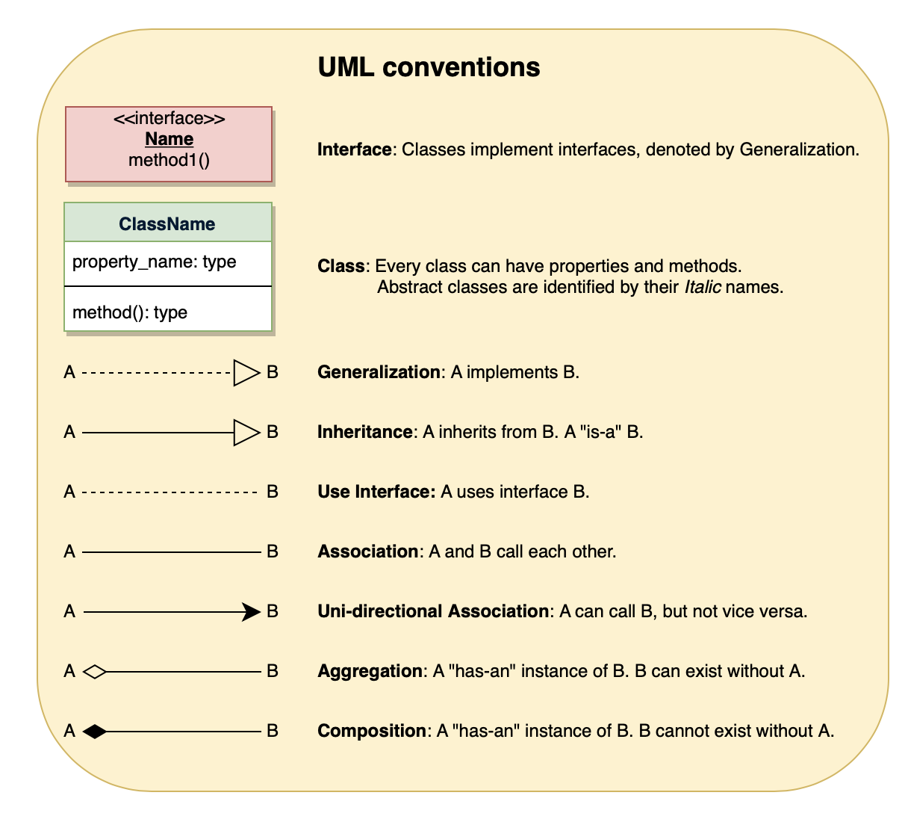

## Use Case Diagrams
Use case diagrams describe a set of actions (called use cases) that a system should or can perform in collaboration with one or more external users of the system (called actors). Each use case should provide some observable and valuable result to the actors.

* Use Case Diagrams describe the high-level functional behavior of the system.
* It answers what system does from the user point of view.
* Use case answers ‘What will the system do?’ and at the same time tells us ‘What will the system NOT do?’.

A use case illustrates a unit of functionality provided by the system. The primary purpose of the use case diagram is to help development teams visualize the functional requirements of a system, including the relationship of “actors” to the essential processes, as well as the relationships among different use cases.

To illustrate a use case on a use case diagram, we draw an oval in the middle of the diagram and put the name of the use case in the center of the oval. To show an actor (indicating a system user) on a use-case diagram, we draw a stick figure to the left or right of the diagram.

* The different components of the use case diagram are:
    * **System boundary**: A system boundary defines the scope and limits of the system. It is shown as a rectangle that spans all use cases of the system.
    * **Actors**: An actor is an entity who performs specific actions. These roles are the actual business roles of the users in a given system. An actor interacts with a use case of the system. For example, in a banking system, the customer is one of the actors.
    * **Use Case**: Every business functionality is a potential use case. The use case should list the discrete business functionality specified in the problem statement.
    * **Include**: Include relationship represents an invocation of one use case by another use case. From a coding perspective, it is like one function being called by another function.
    * **Extend**: This relationship signifies that the extended use case will work exactly like the base use case, except that some new steps will be inserted in the extended use case.

## Class Diagram
Class diagram is the backbone of object-oriented modeling - it shows how different entities (people, things, and data) relate to each other. In other words, it shows the static structures of the system.

A class diagram describes the attributes and operations of a class and also the constraints imposed on the system. Class diagrams are widely used in the modeling of object-oriented systems because they are the only UML diagrams that can be mapped directly to object-oriented languages.

* The purpose of the class diagram can be summarized as:
    * Analysis and design of the static view of an application;
    * To describe the responsibilities of a system;
    * To provide a base for component and deployment diagrams; and,
    * Forward and reverse engineering.

A class is depicted in the class diagram as a rectangle with three horizontal sections, as shown in the figure below. The upper section shows the class’s name (Flight), the middle section contains the properties of the class, and the lower section contains the class’s operations (or “methods”).

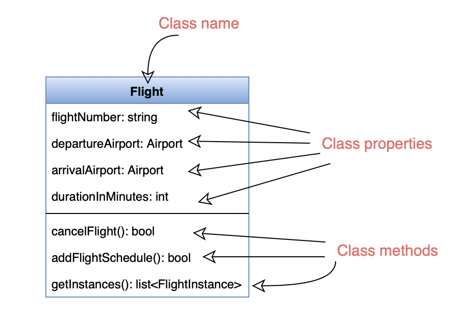

* These are the different types of relationships between classes:
    * **Association**: If two classes in a model need to communicate with each other, there must be a link between them. This link can be represented by an association. Associations can be represented in a class diagram by a line between these classes with an arrow indicating the navigation direction.
        * By default, associations are always assumed to be bi-directional; this means that both classes are aware of each other and their relationship. In the diagram below, the association between Pilot and FlightInstance is bi-directional, as both classes know each other.
        * By contrast, in a uni-directional association, two classes are related - but only one class knows that the relationship exists. In the below example, only Flight class knows about Aircraft; hence it is a uni-directional association
    * **Multiplicity**: Multiplicity indicates how many instances of a class participate in the relationship. It is a constraint that specifies the range of permitted cardinalities between two classes. For example, in the diagram below, one FlightInstance will have two Pilots, while a Pilot can have many FlightInstances. A ranged multiplicity can be expressed as “0…*” which means “zero to many" or as “2…4” which means “two to four”.
        * We can indicate the multiplicity of an association by adding multiplicity adornments to the line denoting the association. The below diagram, demonstrates that a FlightInstance has exactly two Pilots but a Pilot can have many FlightInstances.
    * **Aggregation**: Aggregation is a special type of association used to model a “whole to its parts” relationship. In a basic aggregation relationship, the lifecycle of a PART class is independent of the WHOLE class’s lifecycle. In other words, aggregation implies a relationship where the child can exist independently of the parent. In the above diagram, Aircraft can exist without Airline.
    * **Composition**: The composition aggregation relationship is just another form of the aggregation relationship, but the child class’s instance lifecycle is dependent on the parent class’s instance lifecycle. In other words, Composition implies a relationship where the child cannot exist independent of the parent. In the above example, WeeklySchedule is composed in Flight which means when Flight lifecycle ends, WeeklySchedule automatically gets destroyed.
    * **Generalization**: Generalization is the mechanism for combining similar classes of objects into a single, more general class. Generalization identifies commonalities among a set of entities. In the above diagram, Crew, Pilot, and Admin, all are Person.
    * **Dependency**: A dependency relationship is a relationship in which one class, the client, uses or depends on another class, the supplier. In the above diagram, FlightReservation depends on Payment.
    * **Abstract class**: An abstract class is identified by specifying its name in italics. In the above diagram, both Person and Account classes are abstract classes.

## Sequence diagram
Sequence diagrams describe `interactions among classes` in terms of an exchange of messages over time and are used to explore the logic of complex operations, functions or procedures. In this diagram, the sequence of interactions between the objects is represented in a step-by-step manner.

Sequence diagrams show a detailed flow for a specific use case or even just part of a particular use case. They are almost self-explanatory; they show the calls between the different objects in their sequence and can explain, at a detailed level, different calls to various objects.

A sequence diagram has two dimensions: The vertical dimension shows the sequence of messages in the chronological order that they occur; the horizontal dimension shows the object instances to which the messages are sent.

A sequence diagram is straightforward to draw. Across the top of your diagram, identify the class instances (objects) by putting each class instance inside a box (see below figure). If a class instance sends a message to another class instance, draw a line with an open arrowhead pointing to the receiving class instance and place the name of the message above the line. Optionally, for important messages, you can draw a dotted line with an arrowhead pointing back to the originating class instance; label the returned value above the dotted line.

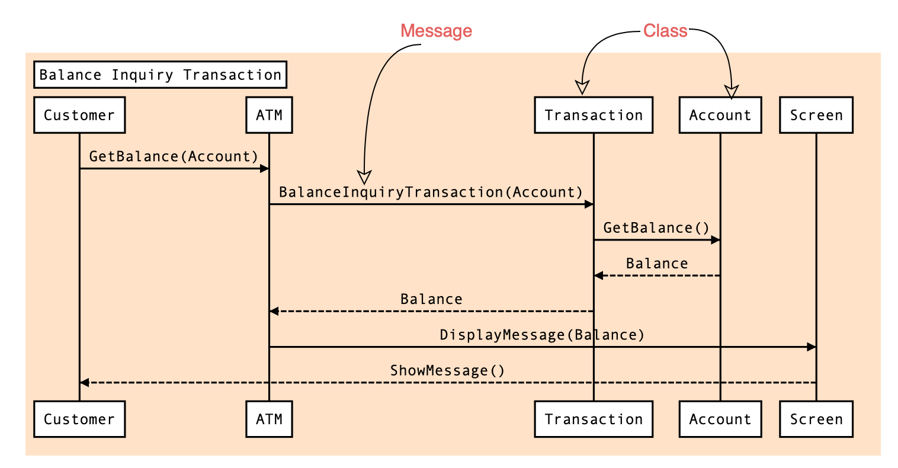

## Activity Diagrams
We use Activity Diagrams to illustrate the `flow of control in a system`. An activity diagram shows the flow of control for a system functionality; it emphasizes the condition of flow and the sequence in which it happens. We can also use an activity diagram to refer to the steps involved in the execution of a use case.

Activity diagrams illustrate the dynamic nature of a system by modeling the flow of control from activity to activity. An activity represents an operation on some class in the system that results in a change in the state of the system. Typically, activity diagrams are used to model workflow or business processes and internal operations.

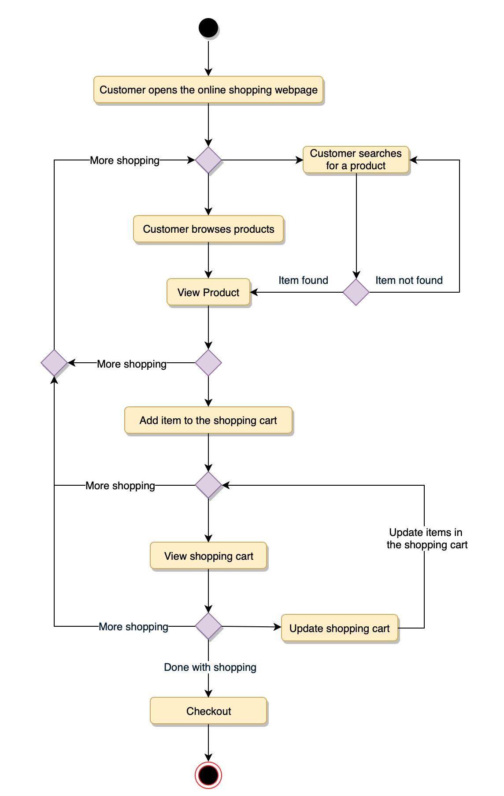

* What is the difference between Activity diagram and Sequence diagram?
    * **Activity diagram** captures the process flow. It is used for functional modeling. A functional model represents the flow of values from external inputs, through operations and internal data stores, to external outputs.
    * **Sequence diagram** tracks the interaction between the objects. It is used for dynamic modeling, which is represented by tracking states, transitions between states, and the events that trigger these transitions.

# Object Oriented Design Case Studies

## Design a Library Management System
### System Requirements
* We will focus on the following set of requirements while designing the Library Management System:
    * Any library member should be able to search books by their title, author, subject category as well by the publication date.Each book will have a unique identification number and other details including a rack number which will help to physically locate the book.
    * There could be more than one copy of a book, and library members should be able to check-out and reserve any copy. We will call each copy of a book, a book item.
    * The system should be able to retrieve information like who took a particular book or what are the books checked-out by a specific library member.
    * There should be a maximum limit (5) on how many books a member can check-out.
    * There should be a maximum limit (10) on how many days a member can keep a book.
    * The system should be able to collect fines for books returned after the due date.
    * Members should be able to reserve books that are not currently available.
    * The system should be able to send notifications whenever the reserved books become available, as well as when the book is not returned within the due date.
    * Each book and member card will have a unique barcode. The system will be able to read barcodes from books and members’ library cards.
    * Any library member should be able to search books by their title, author, subject category as well by the publication date.Each book will have a unique identification number and other details including a rack number which will help to physically locate the book.
    * There could be more than one copy of a book, and library members should be able to check-out and reserve any copy. We will call each copy of a book, a book item.
    * The system should be able to retrieve information like who took a particular book or what are the books checked-out by a specific library member.
    * There should be a maximum limit (5) on how many books a member can check-out.
    * There should be a maximum limit (10) on how many days a member can keep a book.
    * The system should be able to collect fines for books returned after the due date.
    * Members should be able to reserve books that are not currently available.
    * The system should be able to send notifications whenever the reserved books become available, as well as when the book is not returned within the due date.
    * Each book and member card will have a unique barcode. The system will be able to read barcodes from books and members’ library cards.

### Use case diagram
* We have three main actors in our system:
    * **Librarian**: Mainly responsible for adding and modifying books, book items, and users. The Librarian can also issue, reserve, and return book items.
    * **Member**: All members can search the catalog, as well as check-out, reserve, renew, and return a book.
    * **System**: Mainly responsible for sending notifications for overdue books, canceled reservations, etc.

* Here are the top use cases of the Library Management System:
    * **Add/Remove/Edit book**: To add, remove or modify a book or book item.
    * **Search catalog**: To search books by title, author, subject or publication date.
    * **Register new account/cancel membership**: To add a new member or cancel the membership of an existing member.
    * **Check-out book**: To borrow a book from the library.
    * **Reserve book**: To reserve a book which is not currently available.
    * **Renew a book**: To reborrow an already checked-out book.
    * **Return a book**: To return a book to the library which was issued to a member.

### Class diagram
* **Library**: The central part of the organization for which this software has been designed. It has attributes like ‘Name’ to distinguish it from any other libraries and ‘Address’ to describe its location.
* **Book**: The basic building block of the system. Every book will have ISBN, Title, Subject, Publishers, etc.
* **BookItem**: Any book can have multiple copies, each copy will be considered a book item in our system. Each book item will have a unique barcode.
* **Account**: We will have two types of accounts in the system, one will be a general member, and the other will be a librarian.
* **LibraryCard**: Each library user will be issued a library card, which will be used to identify users while issuing or returning books.
* **BookReservation**: Responsible for managing reservations against book items.
* **BookLending**: Manage the checking-out of book items.
* **Catalog**: Catalogs contain list of books sorted on certain criteria. Our system will support searching through four catalogs: Title, Author, Subject, and Publish-date.
* **Fine**: This class will be responsible for calculating and collecting fines from library members.
* **Author**: This class will encapsulate a book author.
* **Rack**: Books will be placed on racks. Each rack will be identified by a rack number and will have a location identifier to describe the physical location of the rack in the library.
* **Notification**: This class will take care of sending notifications to library members.

### Activity diagrams
* **Check-out a book**: Any library member or librarian can perform this activity. Here are the set of steps to check-out a book:
    * 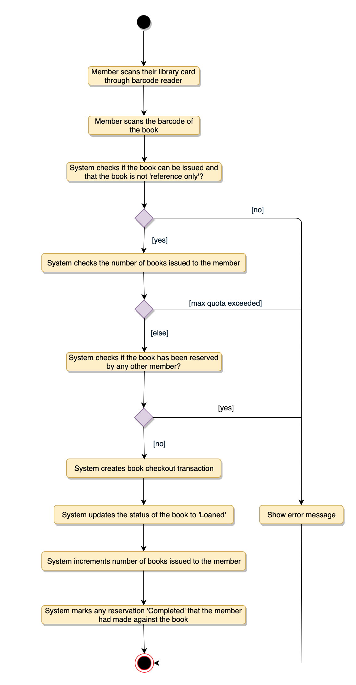
* **Return a book**: Any library member or librarian can perform this activity. The system will collect fines from members if they return books after the due date. Here are the steps for returning a book:
    * 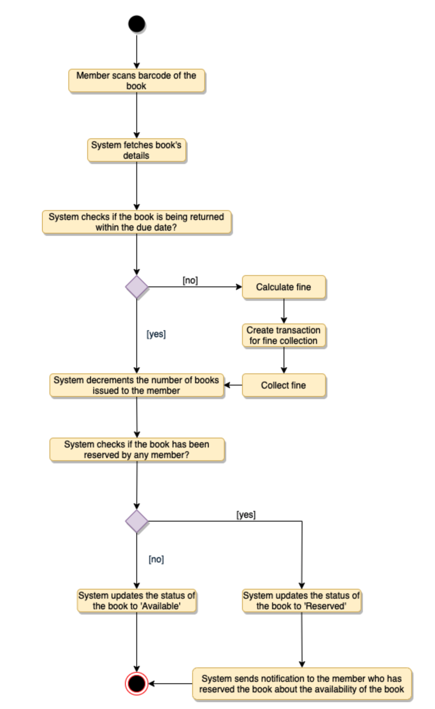
* **Renew a book**: While renewing (re-issuing) a book, the system will check for fines and see if any other member has not reserved the same book, in that case the book item cannot be renewed. Here are the different steps for renewing a book:
    * 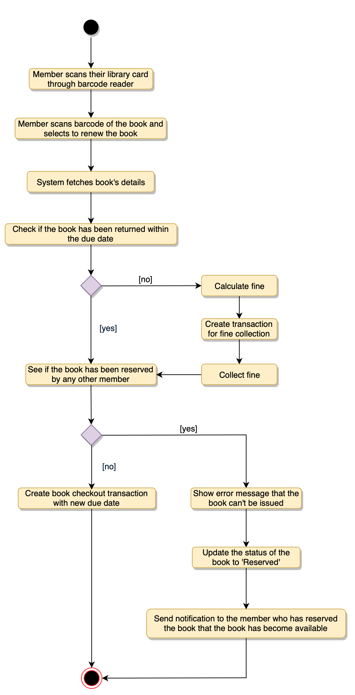

## Design a Parking Lot
A parking lot or car park is a dedicated cleared area that is intended for parking vehicles. In most countries where cars are a major mode of transportation, parking lots are a feature of every city and suburban area. Shopping malls, sports stadiums, megachurches, and similar venues often feature parking lots over large areas.

### System Requirements
The parking lot should have multiple floors where customers can park their cars.
The parking lot should have multiple entry and exit points.
* Customers can collect a parking ticket from the entry points and can pay the parking fee at the exit points on their way out.
* Customers can pay the tickets at the automated exit panel or to the parking attendant.
* Customers can pay via both cash and credit cards.
* Customers should also be able to pay the parking fee at the customer’s info portal on each floor. If the customer has paid at the info portal, they don’t have to pay at the exit.
* The system should not allow more vehicles than the maximum capacity of the parking lot. If the parking is full, the system should be able to show a message at the entrance panel and on the parking display board on the ground floor.
* Each parking floor will have many parking spots. The system should support multiple types of parking spots such as Compact, Large, Handicapped, Motorcycle, etc.
* The Parking lot should have some parking spots specified for electric cars. These spots should have an electric panel through which customers can pay and charge their vehicles.
* The system should support parking for different types of vehicles like car, truck, van, motorcycle, etc.
* Each parking floor should have a display board showing any free parking spot for each spot type.
* The system should support a per-hour parking fee model. For example, customers have to pay $4 for the first hour, $3.5 for the second and third hours, and $2.5 for all the remaining hours.

### Use case diagram
* Here are the main Actors in our system:
    * **Admin**: Mainly responsible for adding and modifying parking floors, parking spots, entrance, and exit panels, adding/removing parking attendants, etc.
    * **Customer**: All customers can get a parking ticket and pay for it.
    * **Parking attendant**: Parking attendants can do all the activities on the customer’s behalf, and can take cash for ticket payment.
    * **System**: To display messages on different info panels, as well as assigning and removing a vehicle from a parking spot.

* Here are the top use cases for Parking Lot:
    * **Add/Remove/Edit parking floor**: To add, remove or modify a parking floor from the system. Each floor can have its own display board to show free parking spots.
    * **Add/Remove/Edit parking spot**: To add, remove or modify a parking spot on a parking floor.
    * **Add/Remove a parking attendant**: To add or remove a parking attendant from the system.
    * **Take ticket**: To provide customers with a new parking ticket when entering the parking lot.
    * **Scan ticket**: To scan a ticket to find out the total charge.
    * **Credit card payment**: To pay the ticket fee with credit card.
    * **Cash payment**: To pay the parking ticket through cash.
    * **Add/Modify parking rate**: To allow admin to add or modify the hourly parking rate.
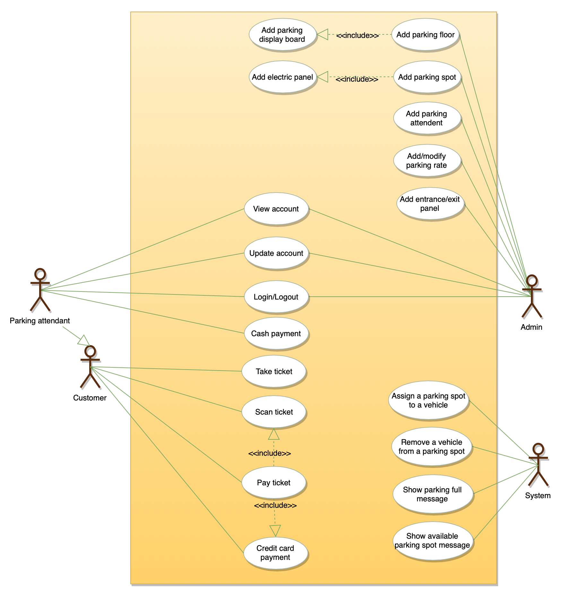

### Class diagram
* **ParkingLot**: The central part of the organization for which this software has been designed. It has attributes like ‘Name’ to distinguish it from any other parking lots and ‘Address’ to define its location.
* **ParkingFloor**: The parking lot will have many parking floors.
* **ParkingSpot**: Each parking floor will have many parking spots. Our system will support different parking spots 1) Handicapped, 2) Compact, 3) Large, 4) Motorcycle, and 5) Electric.
* **Account**: We will have two types of accounts in the system**: one for an Admin, and the other for a parking attendant.
* **Parking ticket**: This class will encapsulate a parking ticket. Customers will take a ticket when they enter the parking lot.
* **Vehicle**: Vehicles will be parked in the parking spots. Our system will support different types of vehicles 1) Car, 2) Truck, 3) Electric, 4) Van and 5) Motorcycle.
* **EntrancePanel and ExitPanel**: EntrancePanel will print tickets, and ExitPanel will facilitate payment of the ticket fee.
* **Payment**: This class will be responsible for making payments. The system will support credit card and cash transactions.
* **ParkingRate**: This class will keep track of the hourly parking rates. It will specify a dollar amount for each hour. For example, for a two hour parking ticket, this class will define the cost for the first and the second hour.
* **ParkingDisplayBoard**: Each parking floor will have a display board to show available parking spots for each spot type. This class will be responsible for displaying the latest availability of free parking spots to the customers.
* **ParkingAttendantPortal**: This class will encapsulate all the operations that an attendant can perform, like scanning tickets and processing payments.
* **CustomerInfoPortal**: This class will encapsulate the info portal that customers use to pay for the parking ticket. Once paid, the info portal will update the ticket to keep track of the payment.
* **ElectricPanel**: Customers will use the electric panels to pay and charge their electric vehicles.

### Activity diagrams
Customer paying for parking ticket: Any customer can perform this activity. Here are the set of steps:

## Design Amazon - Online Shopping System

### Requirements and Goals of the System
* Users should be able to add new products to sell.
* Users should be able to search for products by their name or category.
* Users can search and view all the products, but they will have to become a registered member to buy a product.
* Users should be able to add/remove/modify product items in their shopping cart.
* Users can check out and buy items in the shopping cart.
* Users can rate and add a review for a product.
* The user should be able to specify a shipping address where their order will be delivered.
* Users can cancel an order if it has not shipped.
* Users should get notifications whenever there is a change in the order or shipping status.
* Users should be able to pay through credit cards or electronic bank transfer.
* Users should be able to track their shipment to see the current state of their order.

### Use case Diagram
* We have four main Actors in our system:
    * Admin: Mainly responsible for account management and adding or modifying new product categories.
    * Guest: All guests can search the catalog, add/remove items to the shopping cart, as well as become registered members.
    * Member: Members can perform all the activities that guests can, in addition to which, they can place orders and add new products to sell.
    * System: Mainly responsible for sending notifications for orders and shipping updates.

* Here are the top use cases of the Online Shopping System:
    * Add/update products; whenever a product is added or modified, we will update the catalog.
    * Search for products by their name or category.
    * Add/remove product items in the shopping cart.
    * Check-out to buy product items in the shopping cart.
    * Make a payment to place an order.
    * Add a new product category.
    * Send notifications to members with shipment updates.
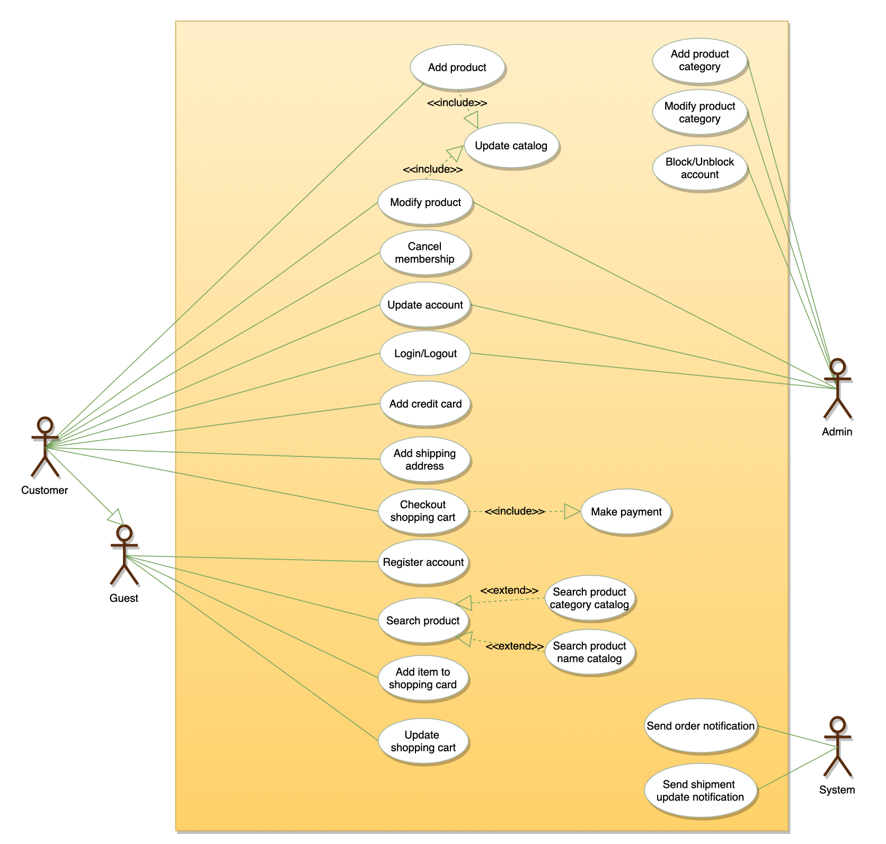

### Class diagram
* **Account**: There are two types of registered accounts in the system**: one will be an Admin, who is responsible for adding new product categories and blocking/unblocking members; the other, a Member, who can buy/sell products.
* **Guest**: Guests can search for and view products, and add them in the shopping cart. To place an order they have to become a registered member.
* **Catalog**: Users of our system can search for products by their name or category. This class will keep an index of all products for faster search.
* **ProductCategory**: This will encapsulate the different categories of products, such as books, electronics, etc.
* **Product**: This class will encapsulate the entity that the users of our system will be buying and selling. Each Product will belong to a ProductCategory.
* **ProductReview**: Any registered member can add a review about a product.
* **ShoppingCart**: Users will add product items that they intend to buy to the shopping cart.
* **Item**: This class will encapsulate a product item that the users will be buying or placing in the shopping cart. For example, a pen could be a product and if there are 10 pens in the inventory, each of these 10 pens will be considered a product item.
* **Order**: This will encapsulate a buying order to buy everything in the shopping cart.
* **OrderLog**: Will keep a track of the status of orders, such as unshipped, pending, complete, canceled, etc.
* **ShipmentLog**: Will keep a track of the status of shipments, such as pending, shipped, delivered, etc.
* **Notification**: This class will take care of sending notifications to customers.
* **Payment**: This class will encapsulate the payment for an order. Members can pay through credit card or electronic bank transfer.

### Activity Diagram
Following is the activity diagram for a user performing online shopping:

### Sequence Diagram
* Here is the sequence diagram for searching from the catalog:
    * 

* Here is the sequence diagram for adding an item to the shopping cart:
    * 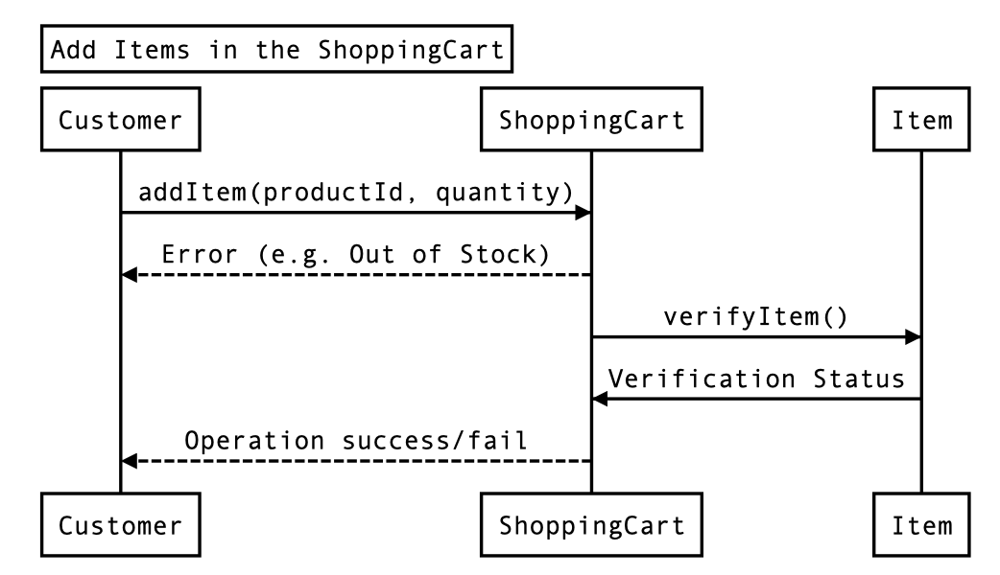

* Here is the sequence diagram for checking out to place an order:
    * 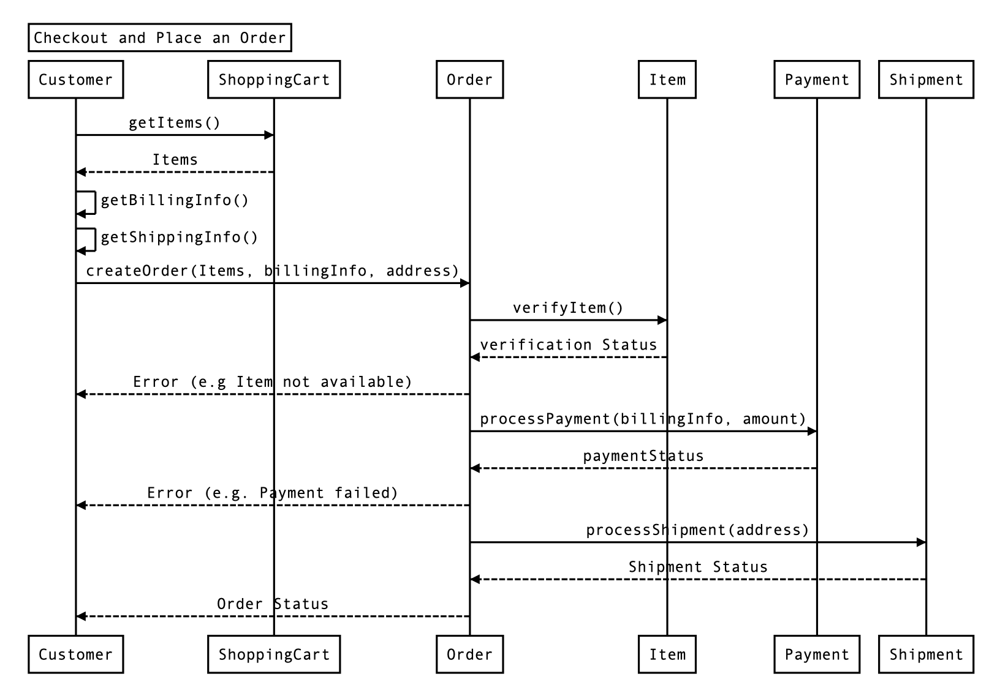

## Design Stack Overflow
### Requirements and Goals of the System
* Any non-member (guest) can search and view questions. However, to add or upvote a question, they have to become a member.
* Members should be able to post new questions.
* Members should be able to add an answer to an open question.
* Members can add comments to any question or answer.
* A member can upvote a question, answer or comment.
* Members can flag a question, answer or comment, for serious problems or moderator attention.
* Any member can add a bounty to their question to draw attention.
* Members will earn badges for being helpful.
* Members can vote to close a question; Moderators can close or reopen any question.
* Members can add tags to their questions. A tag is a word or phrase that describes the topic of the question.
* Members can vote to delete extremely off-topic or very low-quality questions.
* Moderators can close a question or undelete an already deleted question.
* The system should also be able to identify most frequently used tags in the questions.

### Use-case Diagram
* We have five main actors in our system:
    * **Admin**: Mainly responsible for blocking or unblocking members.
    * **Guest**: All guests can search and view questions.
    * **Member**: Members can perform all activities that guests can, in addition to which they can add/remove questions, answers, and comments. Members can delete and un-delete their questions, answers or comments.
    * **Moderator**: In addition to all the activities that members can perform, moderators can close/delete/undelete any question.
    * **System**: Mainly responsible for sending notifications and assigning badges to members.

* Here are the top use cases for Stack Overflow:
    * Search questions.
    * Create a new question with bounty and tags.
    * Add/modify answers to questions.
    * Add comments to questions or answers.
    * Moderators can close, delete, and un-delete any question.

### Class diagram
* **Question**: This class is the central part of our system. It has attributes like Title and Description to define the question. In addition to this, we will track the number of times a question has been viewed or voted on. We should also track the status of a question, as well as closing remarks if the question is closed.
* **Answer**: The most important attributes of any answer will be the text and the view count. In addition to that, we will also track the number of times an answer is voted on or flagged. We should also track if the question owner has accepted an answer.
* **Comment**: Similar to answer, comments will have text, and view, vote, and flag counts. Members can add comments to questions and answers.
* **Tag**: Tags will be identified by their names and will have a field for a description to define them. We will also track daily and weekly frequencies at which tags are associated with questions.
* **Badge**: Similar to tags, badges will have a name and description.
* **Photo**: Questions or answers can have photos.
* **Bounty**: Each member, while asking a question, can place a bounty to draw attention. Bounties will have a total reputation and an expiry date.
* **Account**: We will have four types of accounts in the system, guest, member, admin, and moderator. Guests can search and view questions. Members can ask questions and earn reputation by answering questions and from bounties.
* **Notification**: This class will be responsible for sending notifications to members and assigning badges to members based on their reputations.

### Activity diagrams
Post a new question: Any member or moderator can perform this activity. Here are the steps to post a question:

### Sequence Diagram

## Design a Movie Ticket Booking System
### Requirements and Goals of the System
* It should be able to list the cities where affiliate cinemas are located.
* Each cinema can have multiple halls and each hall can run one movie show at a time.
* Each Movie will have multiple shows.
* Customers should be able to search movies by their title, language, genre, release date, and city name.
* Once the customer selects a movie, the service should display the cinemas running that movie and its available shows.
* The customer should be able to select a show at a particular cinema and book their tickets.
* The service should show the customer the seating arrangement of the cinema hall. The customer should be able to select multiple seats according to their preference.
* The customer should be able to distinguish between available seats and booked ones.
* The system should send notifications whenever there is a new movie, as well as when a booking is made or canceled.
* Customers of our system should be able to pay with credit cards or cash.
* The system should ensure that no two customers can reserve the same seat.
* Customers should be able to add a discount coupon to their payment.

### Use case diagram
* We have five main Actors in our system:
    * **Admin**: Responsible for adding new movies and their shows, canceling any movie or show, blocking/unblocking customers, etc.
    * **FrontDeskOfficer**: Can book/cancel tickets.
    * **Customer**: Can view movie schedules, book, and cancel tickets.
    * **Guest**: All guests can search movies but to book seats they have to become a registered member.
    * **System**: Mainly responsible for sending notifications for new movies, bookings, cancellations, etc.

* Here are the top use cases of the Movie Ticket Booking System:
    * **Search movies**: To search movies by title, genre, language, release date, and city name.
    * **Create/Modify/View booking**: To book a movie show ticket, cancel it or view details about the show.
    * **Make payment for booking**: To pay for the booking.
    * **Add a coupon to the payment**: To add a discount coupon to the payment.
    * **Assign Seat**: Customers will be shown a seat map to let them select seats for their booking.
    * **Refund payment**: Upon cancellation, customers will be refunded the payment amount as long as the cancellation occurs within the allowed time frame.

### Class diagram
* **Account**: Admin will be able to add/remove movies and shows, as well as block/unblock accounts. Customers can search for movies and make bookings for shows. FrontDeskOffice can book tickets for movie shows.
* **Guest**: Guests can search and view movies descriptions. To make a booking for a show they have to become a registered member.
* **Cinema**: The main part of the organization for which this software has been designed. It has attributes like ‘name’ to distinguish it from other cinemas.
* **CinemaHall**: Each cinema will have multiple halls containing multiple seats.
* **City**: Each city can have multiple cinemas.
* **Movie**: The main entity of the system. Movies have attributes like title, description, language, genre, release date, city name, etc.
* **Show**: Each movie can have many shows; each show will be played in a cinema hall.
* **CinemaHallSeat**: Each cinema hall will have many seats.
* **ShowSeat**: Each ShowSeat will correspond to a movie Show and a CinemaHallSeat. Customers will make a booking against a ShowSeat.
* **Booking**: A booking is against a movie show and has attributes like a unique booking number, number of seats, and status.
* **Payment**: Responsible for collecting payments from customers.
* **Notification**: Will take care of sending notifications to customers.

### Activity Diagram
Make a booking: Any customer can perform this activity. Here are the steps to book a ticket for a show:

Cancel a booking: Customer can cancel their bookings. Here are the steps to cancel a booking:
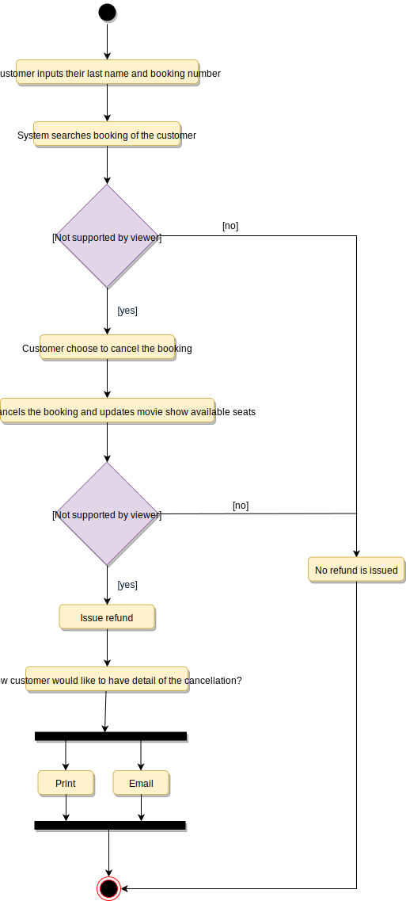

## Design an ATM
### Requirements and Goals of the System
* The main components of the ATM that will affect interactions between the ATM and its users are:
    * **Card reader**: to read the users’ ATM cards.
    * **Keypad**: to enter information into the ATM e.g. PIN. cards.
    * **Screen**: to display messages to the users.
    * **Cash dispenser**: for dispensing cash.
    * **Deposit slot**: For users to deposit cash or checks.
    * **Printer**: for printing receipts.
    * **Communication/Network Infrastructure**: it is assumed that the ATM has a communication infrastructure to communicate with the bank upon any transaction or activity.

* The user can have two types of accounts: 1) Checking, and 2) Savings, and should be able to perform the following five transactions on the ATM:
    * **Balance inquiry**: To see the amount of funds in each account.
    * **Deposit cash**: To deposit cash.
    * **Deposit check**: To deposit checks.
    * **Withdraw cash**: To withdraw money from their checking account.
    * **Transfer funds**: To transfer funds to another account.

### How ATM works?
The ATM will be managed by an operator, who operates the ATM and refills it with cash and receipts. The ATM will serve one customer at a time and should not shut down while serving. To begin a transaction in the ATM, the user should insert their ATM card, which will contain their account information. Then, the user should enter their Personal Identification Number (PIN) for authentication. The ATM will send the user’s information to the bank for authentication; without authentication, the user cannot perform any transaction/service.

The user’s ATM card will be kept in the ATM until the user ends a session. For example, the user can end a session at any time by pressing the cancel button, and the ATM Card will be ejected. The ATM will maintain an internal log of transactions that contains information about hardware failures; this log will be used by the ATM operator to resolve any issues.

* Identify the system user through their PIN.
* In the case of depositing checks, the amount of the check will not be added instantly to the user account; it is subject to manual verification and bank approval.
* It is assumed that the bank manager will have access to the ATM’s system information stored in the bank database.
* It is assumed that user deposits will not be added to their account immediately because it will be subject to verification by the bank.
* It is assumed the ATM card is the main player when it comes to security; users will authenticate themselves with their debit card and security pin.

### Use cases
* **Operator**: The operator will be responsible for the following operations:
    * Turning the ATM ON/OFF using the designated Key-Switch.
    * Refilling the ATM with cash.
    * Refilling the ATM’s printer with receipts.
    * Refilling the ATM’s printer with INK.
    * Take out deposited cash and checks.

* **Customer**: The ATM customer can perform the following operations:
    * Balance inquiry: the user can view his/her account balance.
    * Cash withdrawal: the user can withdraw a certain amount of cash.
    * Deposit funds: the user can deposit cash or checks.
    * Transfer funds: the user can transfer funds to other accounts.

* **Bank Manager**: The Bank Manager can perform the following operations:
    * Generate a report to check total deposits.
    * Generate a report to check total withdrawals.
    * Print total deposits/withdrawal reports.
    * Checks the remaining cash in the ATM.
    * Here is the use case diagram of our ATM system:

### Class diagram
* **ATM**: The main part of the system for which this software has been designed. It has attributes like ‘atmID’ to distinguish it from other available ATMs, and ‘location’ which defines the physical address of the ATM.
* **CardReader**: To encapsulate the ATM’s card reader used for user authentication.
* **CashDispenser**: To encapsulate the ATM component which will dispense cash.
* **Keypad**: The user will use the ATM’s keypad to enter their PIN or amounts.
* **Screen**: Users will be shown all messages on the screen and they will select different transactions by touching the screen.
* **Printer**: To print receipts.
* **DepositSlot**: User can deposit checks or cash through the deposit slot.
* **Bank**: To encapsulate the bank which ownns the ATM. The bank will hold all the account information and the ATM will communicate with the bank to perform customer transactions.
* **Account**: We’ll have two types of accounts in the system**: 1)Checking and 2)Saving.
* **Customer**: This class will encapsulate the ATM’s customer. It will have the customer’s basic information like name, email, etc.
* **Card**: Encapsulating the ATM card that the customer will use to authenticate themselves. Each customer can have one card.
* **Transaction**: Encapsulating all transactions that the customer can perform on the ATM, like BalanceInquiry, Deposit, Withdraw, etc.

### Activity Diagram
* Customer authentication: Following is the activity diagram for a customer authenticating themselves to perform an ATM transaction:
    * 

* Withdraw: Following is the activity diagram for a user withdrawing cash:
    * 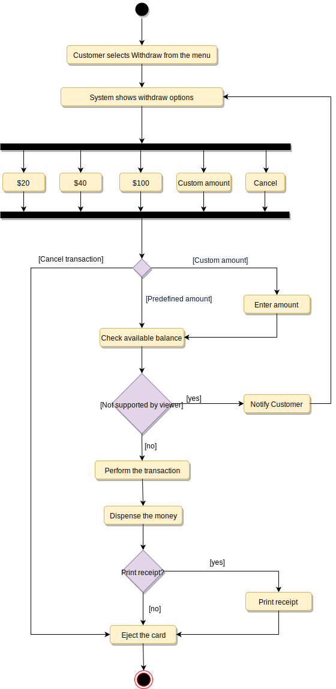

* Deposit check: Following is the activity diagram for the customer depositing a check:
    * 
* Transfer: Following is the activity diagram for a user transferring funds to another account:
    * 

### Sequence Diagram
Here is the sequence diagram for balance inquiry transaction:

## Design an Airline Management System
## Design Blackjack and a Deck of Cards
## Design a Hotel Management System
## Design a Restaurant Management system
## Design Chess
## Design an Online Stock Brokerage System
## Design a Car Rental System
## Design LinkedIn
## Design Cricinfo
## Design Facebook - a social network