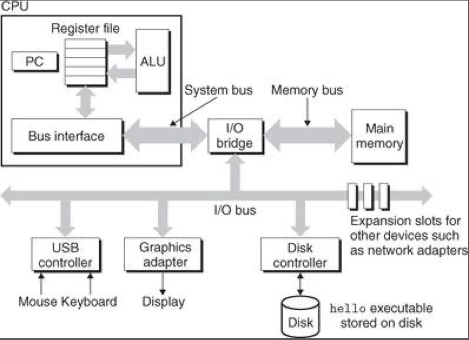
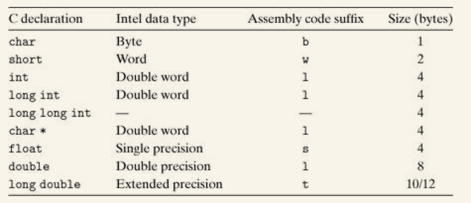
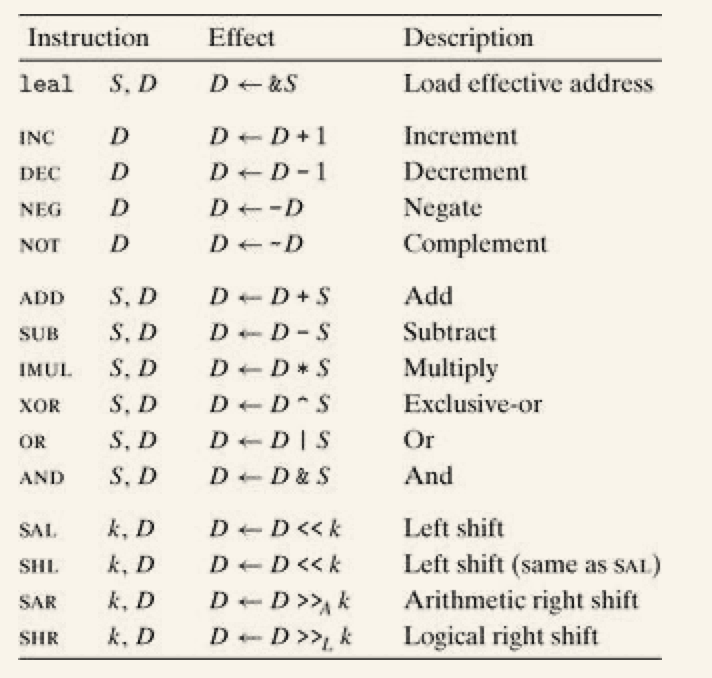
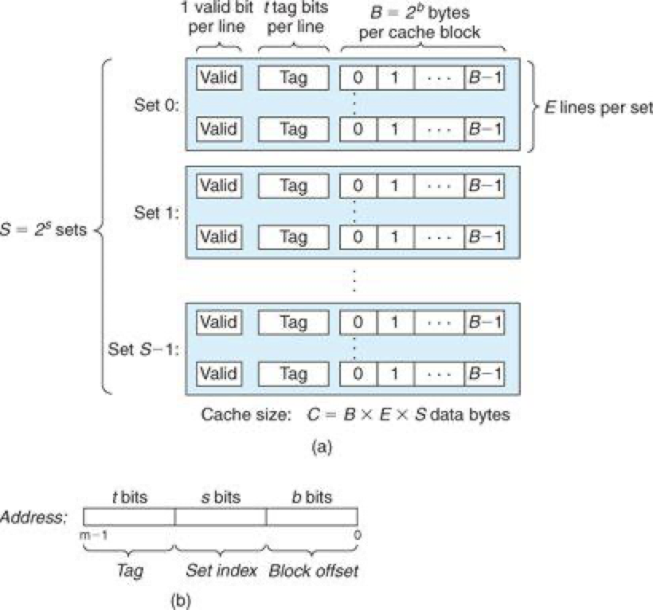

# Chapter 1 A Tour of Computer System
### 1.1 Information Is Bits + Context
### 1.2 Programs Are Translated by Other Programs into Different Forms
Compilation System:
1. Preprocessor
2. Compiler
    Each statement in an assembly-language program exactly describes one low-level machine-language instruction in a standard text form.
    Assembly language is useful because it provides a common output language for different compilers for different high-level languages.
3. Assembler
    Assembler (as) translates hello.s into machine-language instructions, packages them in a form known as a relocatable object program, and stores the result in the object file.
4. Linker

#### 1.4.1 Hardware Organization of a System

    CPU: Central Processing Unit
    ALU: Arithmetic/Logic Unit
    PC: Program counter
    USB: Universal Serial Bus.

### 1.7 The Operating System Manages the Hardware
The operating system has two primary purposes:
1. to protect the hardware from misuse by runaway applications
2. to provide applications with simple and uniform mechanisms for manipulating complicated and often wildly different low-level hardware devices.

**Files** are abstractions for I/O devices, **virtual memory** is an abstraction for both the main memory and disk I/O devices, and **processes** are abstractions for the processor, main memory, and I/O devices. The **virtual machine** provids an abstraction of the entire computer, including the operating system, the processor, and the programs.

Posix standards, that cover such issues as the C language interface for Unix system calls, shell programs and utilities, threads, and network programming.

#### 1.7.1 Processes
A process is the operating system’s abstraction for a running program. Multiple processes can run concurrently on the same system, and each process appears to have exclusive use of the hardware.

Context, includes information such as the current values of the PC, the register file, and the contents of main memory.

#### 1.7.2 Threads
A process can actually consist of multiple execution units, called threads, each running in the context of the process and sharing the same code and global data.

It is easier to share data between multiple threads than between multiple processes, and because threads are typically more efficient than processes.

#### 1.7.3 Virutal Memory
Virtual memory is an abstraction that provides each process with the illusion that it has exclusive use of the main memory.

### 1.9 Important Themes
#### 1.9.1 Concurrency and Parallelism
We use the term concurrency to refer to the general concept of a system with multiple, simultaneous activities, and the term parallelism to refer to the use of concurrency to make a system run faster.

##### Thread-Level Concurrency
The use of multiprocessing can improve system performance in two ways:
1. It reduces the need to simulate concurrency when performing multiple tasks.
2. It can run a single application program faster, but only if that program is expressed in terms of multiple threads that can effectively execute in parallel.

##### Instruction-Level Parallelism

##### Single-Instruction, Multiple-Data (SIMD) Parallelism

# Chapter 2 Representing and Manipulating Information
### 2.1 Information Storage
#### 2.1.4 Addressing and Byte Ordering
Byte ordering becomes an issue:
1. The first is when binary data are communicated over a network between different machines.
2. A second case where byte ordering becomes important is when looking at the byte sequences representing integer data.
3. A third case where byte ordering becomes visible is when programs are written that circumvent the normal type system.

#### 2.2.4 Conversions between Signed and Unsigned

The effect of casting is to keep the bit values identical but change how these bits are interpreted.

#### 2.2.5 Signed vs. Unsigned in C

Some of the peculiar behavior arises due to C’s handling of expressions containing combinations of signed and unsigned quantities. When an operation is performed where one operand is signed and the other is unsigned, C implicitly casts the signed argument to unsigned and performs the operations assuming the numbers are nonnegative. As we will see, this convention makes little difference for standard arithmetic operations, but it leads to nonintuitive results for relational operators such as < and >.

    Consider the comparison -1 < 0U. Since the second operand is unsigned, the first one is implicitly cast to unsigned, and hence the expression is equivalent to the comparison 4294967295U < 0U (recall that T2Uw (−1) = UMaxw), which of course is false.
#### 2.2.6 Expanding the Bit Representation of a Number
To convert an unsigned number to a larger data type, we can simply add *leading zeros* to the representation; this operation is known as **zero extension**.

For converting a two’s-complement number to a larger data type, the rule is to perform a **sign extension**, adding copies of the *most significant bit* to the representation.

    short sx = -1234;
    unsigned uy = sx;
    printf("uy = %u\n", uy); // 4294954951: ff ff cf c7

    when converting from short to unsigned, we first change the size and then from signed to unsigned. That is, (unsigned) sx is equivalent to (unsigned) (int) sx, evaluating to 4,294,954,951, not (unsigned) (unsigned short) sx, which evaluates to 53,191. Indeed this convention is required by the C standards.

#### 2.2.7 Truncating Numbers
For an unsigned number x, the result of truncating it to k bits is equivalent to computing x mod 2k.


### 2.3 Integer Arithmetic
> TODO

### 2.4 Floating Point
#### 2.4.1 Fractional Binary Number

# Chapter 3 Machine-Level Representation of Programs

#### 3.2.1 Machine-Level Code
* The program counter (commonly referred to as the “PC,” and called %eip in IA32) indicates the address in memory of the next instruction to be executed.
* The integer register file contains eight named locations storing 32-bit values. These registers can hold addresses (corresponding to C pointers) or integer data. Some registers are used to keep track of critical parts of the program state, while others are used to hold temporary data, such as the local variables of a procedure, and the value to be returned by a function.
* The condition code registers hold status information about the most recently executed arithmetic or logical instruction. These are used to implement conditional changes in the control or data flow, such as is required to implement if and while statements.
* A set of floating-point registers store floating-point data.

#### 3.2.3 Code Example
Several features about machine code and its disassembled representation are worth noting:
* IA32 instructions can range in length from 1 to 15 bytes. The instruction encoding is designed so that commonly used instructions and those with fewer operands require a smaller number of bytes than do less common ones or ones with more operands.
* The instruction format is designed in such a way that from a given starting position, there is a unique decoding of the bytes into machine instructions. For example, only the instruction pushl %ebp can start with byte value 55.
* The disassembler determines the assembly code based purely on the byte sequences in the machine-code file. It does not require access to the source or assembly-code versions of the program.
* The disassembler uses a slightly different naming convention for the instructions than does the assembly code generated by GCC. In our example, it has omitted the suffix ‘1’ from many of the instructions. These suffixes are size designators and can be omitted in most cases.

### 3.3 Data Formts


### 3.4 Accessing Information


#### 3.4.1 Operand Specifiers


#### 3.4.2 Data Movement Instructions


With sign expansion, the upper bits of the destination are filled in with copies of the most significant bit of the source value. With zero expansion, the upper bits are filled with zeros.
```assembly
// %dh = CD, %eax = 98765432
movb    %dh %eax;   // %eax = 987654CD
movsbl  %dh %eax;   // %eax = FFFFFFCD
movzbl  %dh %eax;   // %eax = 000000CD
```

As with the movl instruction, however, the two operands cannot both be memory locations.

#### 3.4.3

### 3.5 Arithmatic and Logic Operations

### 3.5.1 Load Affect Address

#### 3.5.5 Special Arithmetic Operations
One argument must be in register %eax, and the other is given as the instruction source operand. The product is then stored in registers %edx (high-order 32 bits) and %eax (low-order 32 bits).

#### 3.6.1 Condition Codes
* CF: Carry Flag. The most recent operation generated a carry out of the most significant bit. Used to detect overflow for unsigned operations.
* ZF: Zero Flag. The most recent operation yielded zero.
* SF: Sign Flag. The most recent operation yielded a negative value.
* OF: Overflow Flag. The most recent operation caused a two’s-complement overflow—either negative or positive.

#### 3.6.2 Accessing the Condition Codes”
Rather than reading the condition codes directly, there are three common ways of using the condition codes:
* we can set a single byte to 0 or 1 depending on some combination of the condition codes
* we can conditionally jump to some other part of the program
* we can conditionally transfer data.

A SET instruction has either one of the eight single-byte register elements (Figure 3.2) or a single-byte memory location as its destination, setting this byte to either 0 or 1.


#### 3.6.1 Condition Codes
#### 3.6.3 Jump Instructions and Their Encoding
In assembly code, jump targets are written using symbolic labels. The assembler, and later the linker, generate the proper encodings of the jump targets. There are several different encodings for jumps:
* The most commonly used ones are PC relative. That is, they encode the difference between the address of the target instruction and the address of the instruction immediately following the jump. These offsets can be encoded using 1, 2, or 4 bytes.
* A second encoding method is to give an “absolute” address, using 4 bytes to directly specify the target.

### 3.7 Procedures
#### 3.7.3 Register Usage Conventions
Registers %eax, %edx, and %ecx are classified as **caller-save registers**. When procedure Q is called by P, it can overwrite these registers without destroying any data required by P.

On the other hand, registers %ebx, %esi, and %edi are classified as **callee-save registers**. This means that Q must save the values of any of these registers on the stack before overwriting them, and restore them before returning.

#### 3.8.2 Pointer Arithmetic


### 3.9 Heterogeneous Data Structures

#### 3.12.1 Thwarting Buffer Overflow Attack
**Statck Randomization**

    In order to insert exploit code into a system, the attacker needs to inject both the code as well as a pointer to this code as part of the attack string.

    The idea of stack randomization is to make the position of the stack vary from one run of a program to another.

    This is implemented by allocating a random amount of space between 0 and n bytes on the stack at the start of a program.

**Stack Corruption Detection**

**Limiting Executable Code Regions**

# Chapter 4 Processor Arthitecture
The instructions supported by a particular processor and their byte-level encodings are known as its instruction-set architecture (ISA).

### 4.1 The Y86 Instruction Set Architecture
#### 4.1.1 Programmer-Visible State
1. Program registers: %eax, %ebx %ecx, %edx, %edi, %esi, %ebp, %esp
2. Condition codes: ZF, SF, OF


# Chapter 6 The Memory Hierarchy
### 6.4 Cache Memories
#### 6.4.1 Generic Cache Memory Organization


Why index with the middle bits?
> If the high-order bits are used as an index, then some contiguous memory blocks will map to the same cache set.

#### 6.4.5 Issues with Writes
As a rule, caches at lower levels of the memory hierarchy are more likely to use write-back instead of write-through because of the larger transfer times.

#### 6.4.7 Performance Impact of Cache Parameters
1. Hit rate
2. Hit time
3. Miss rate
4. Miss penalty

### 6.5 Writing Cache-friendly Code
Programs with better locality will tend to have lower miss rates, and programs with lower miss rates will tend to run faster than programs with higher miss rates.


# Chapter 8 Exceptional Control Flow
### 8.1 Exception
When the exception handler finishes processing, one of three things happens, depending on the type of event that caused the exception:
1. The handler returns control to the current instruction Icurr, the instruction that was executing when the event occurred.
2. The handler returns control to Inext, the instruction that would have executed next had the exception not occurred.
3. The handler aborts the interrupted program.

#### 8.1.2 Classes of Exceptions
1. Interrupt
2. Trapping System Call
3. Fatal
    If the handler is able to correct the error condition, it returns control to the faulting instruction, thereby reexecuting it. Otherwise, the handler returns to an abort routine in the kernel that terminates the application program that caused the fault.
4. Abort

### 8.1.3 Exceptions in Linux/IA32 Systems
All parameters to Linux system calls are passed through general purpose registers rather than the stack. **rdi, rsi, rbx, rcx, rdx, ebp**

### 8.2 Processes
The process abstractions that provided to the application:
1. An independent logical control flow that provides the illusion that our program has exclusive use of the processor.
2. A private address space that provides the illusion that our program has exclusive use of the memory system.

#### 8.2.2 Concurrent Flows
A logical flow whose execution overlaps in time with another flow is called a **concurrent flow**, and the two flows are said to run concurrently.

If two flows are running concurrently on different processor cores or computers, then we say that they are **parallel flows**.

#### 8.2.4 User and Kernel Mode
When the exception occurs, and control passes to the exception handler, the processor changes the mode from user mode to kernel mode. The handler runs in kernel mode.

#### 8.2.5 Context Switch
The context switch mechanism is built on top of the lower-level exception mechanism.

The kernel maintains a context for each process. The context is the state that the kernel needs to restart a preempted process. It consists of the values of objects such as the **general purpose registers**, the **floating-point registers**, the **program counter**, **user’s stack**, **status registers**, **kernel’s stack**, and various kernel data structures such as a **page table** that characterizes the address space, a **process table** that contains information about the current process, and a **file table** that contains information about the files that the process has opened.

context switch that:
1. saves the context of the current process
2. restores the saved context of some previously preempted process
3. passes control to this newly restored process.

If the system call blocks because it is waiting for some event to occur, then the kernel can put the current process to sleep and switch to another process.

### 8.4 Process Control
#### 8.4.3 Reaping Child Process
If the parent process terminates without reaping its zombie children, the kernel arranges for the init process to reap them.

### 8.5 Signals
#### 8.5.1 Signal Terminology
A signal that has been sent but not yet received is called a **pending signal**.

At any point in time, there can be at most one pending signal of a particular type.

When a signal is blocked, it can be delivered, but the resulting pending signal will not be received until the process unblocks the signal.

Kernel maintains the set of pending signals in the pending bit vector, and the set of blocked signals in the blocked bit vector.

#### 8.5.4 Signal Handling Issues
1. Pending signals are blocked.
2. Pending signals are not queued. There can be at most one pending signal of any particular type.
3. System calls (e.g., read, write, accept) can be interrupted, when a handler catches a signal do not resume when the signal handler returns, but instead return immediately to the user with an error condition and errno set to EINTR.

On particular system, slow system calls such as read are not restarted automatically after they are interrupted by the delivery of a signal.
Instead, they return prematurely to the calling application with an error condition, unlike Linux systems, which restart interrupted system calls automatically.


# Chapter 9 Virtual Memory
Virtual memory is an elegant interaction of hardware exceptions, hardware address translation, main memory, disk files, and kernel software that provides each process with a large, uniform, and private address space.

virtual memory provides three important capabilities:
* It uses main memory efficiently by treating it as a cache for an address space stored on disk, keeping only the active areas in main memory, and transferring data back and forth between disk and memory as needed.
* It simplifies memory management by providing each process with a uniform address space.
* It protects the address space of each process from corruption by other processes.

### 9.4 VM as a Tool for Memory Management
VM simplifies linking and loading, the sharing of code and data, and allocating memory to applications.

### 9.7 Case Study: The Intel Core i7/Linux Memory System
The TLBs are virtually addressed, and four-way set associative. The L1, L2, and L3 caches are physically addressed, and eight-way set associative, with a block size of 64 bytes. The page size can be configured at start-up time as either 4 KB or 4 MB. Linux uses 4-KB pages.

### 9.8 Memory Mapping
Areas can be mapped to one of two types of objects:
1. Regular file in the Unix file system:
2. Anonymous file. Pages in areas that are mapped to anonymous files are sometimes called demand-zero pages.

#### 9.8.3 The execve Function Revisited
Loading and running a.out requires the following steps
1. Delete existing user areas.
2. Map private areas. text, data, bss, and stack areas of the new program. All of these new areas are private copy-on-write.
3. Map shared areas.
4. Set the program counter (PC).

### 9.9 Dynamic Memory Allocation
#### 9.9.5 Implementation Issues
A practical allocator that strikes a better balance between throughput and utilization must consider the following issues:
1. Free block organization: How do we keep track of free blocks?
2. Placement: How do we choose an appropriate free block in which to place a newly allocated block?
3. Splitting: After we place a newly allocated block in some free block, what do we do with the remainder of the free block?
4. Coalescing: What do we do with a block that has just been freed?

#### 9.9.6 Implicit Free Lists
#### 9.9.7 Placing Allocated Blocks
Placement policy: first fit, next fit, and best fit.

#### 9.9.10 Coalescing Free Blocks
#### 9.9.11 Coalescing with Boundary Tags
There is one somewhat subtle aspect. The free list format we have chosen—with its prologue and epilogue blocks that are always marked as allocated—allows us to ignore the potentially troublesome edge conditions where the requested block bp is at the beginning or end of the heap.

#### 9.9.13 Explicit Free Lists
Because block allocation time is linear in the total number of heap blocks, the implicit free list is not appropriate for a general-purpose allocator.

Using a doubly linked list instead of an implicit free list reduces the first fit allocation time from linear in the total number of blocks to linear in the number of free blocks.

#### 9.9.14 Segregated Free Lists

Segregated Fits
Each free list is associated with a size class and is organized as some kind of explicit or implicit list.

Search times are reduced because searches are limited to particular parts of the heap instead of the entire heap. Memory utilization can improve because of the interesting fact that a simple first-fit search of a segregated free list approximates a best-fit search of the entire heap.

#### Reference

https://mp.weixin.qq.com/s/dOgpcRiu3F18EpFWcnv5XQ


# Chapter 10 System-Level I/O

### Unix I/O


```
Questions:
1. Hoe does Optimizing address translation work? Page-1119
2.
```