# 1Computer Abstractions and Technology
## 1.1 Introduction
## 1.2 Eight Great Ideas in Computer Architecture
## 1.3 Below Your Program
## 1.4 Under the Covers
## 1.5 Technologies for Building Processors and Memory

## 1.6 Performance

### 1.6.1 Defining Performance

**response time** Also called **execution time**. The total time required for the computer to complete a task, including disk accesses, memory accesses, I/O activities, operating system overhead, CPU execution time, and so on.

**throughput** Also called **bandwidth**. Another measure of performance, it is the number of tasks completed per unit time.

```c++
PerformanceX = 1 / Execution timeX
```

### 1.6.2 Measuring Performance

The most straightforward definition of time is called **wall clock time**, **response time**, or **elapsed time**.

**CPU execution time** Also called **CPU time**. The time the CPU spends computing for this task and does not include time spent waiting for I/O or running other programs.

**user CPU time** The CPU time spent in a program itself.

**system CPU time** The CPU time spent in the operating system performing tasks on behalf of the program.

We maintain a distinction between performance based on elapsed time and that based on CPU execution time. We will use the term **system performance** to refer to elapsed time on an unloaded system and **CPU performance** to refer to user CPU time.

**clock cycle** Also called **tick**, **clock tick**, **clock period**, **clock**, or **cycle**. The time for one clock period, usually of the processor clock, which runs at a constant rate.

**clock period** The length of each clock cycle.

**clock rate** (e.g., 4 gigahertz, or 4 GHz), which is the inverse of the clock period.

### 1.6.3 CPU Performance and Its Factors

```c++
<CPU execution time for a program> = <CPU clock cycles for a program> * <Clock cycle time>
```

### 1.6.4 Instruction Performance

**clock cycles per instruction (CPI)** Average number of clock cycles per instruction for a program or program fragment.

```c++
<CPU clock cycles> = <Instructions for a program> * CPI
```

Since different instructions may take different amounts of time depending on what they do, CPI is an average of all the instructions executed in the program. CPI provides one way of comparing two different implementations of the same instruction set architecture, since the number of instructions executed for a program will, of course, be the same.

### 1.6.5 The Classic CPU Performance Equation

**instruction count** The number of instructions executed by the program.

```c++
<CPU time> = <Instruction count> * CPI * <Clock cycle time>
```

Components of performance | Units of measure
--- | ---
CPU execution time for a program | Seconds for the program
Instruction count | Instructions executed for the program
Clock cycles per instruction (CPI) | Average number of clock cycles per instruction
Clock cycle time | Seconds per clock cycle

**instruction mix** A measure of the dynamic frequency of instructions across one or many programs.

Hardware or software component | Affects what? | How?
--- | --- | ---
Algorithm | Instruction count, possibly CPI | The algorithm determines the number of source program instructions executed and hence the number of processor instructions executed. The algorithm may also affect the CPI, by favoring slower or faster instructions. For example, if the algorithm uses more divides, it will tend to have a higher CPI.
Programming language | Instruction count, CPI | The programming language certainly affects the instruction count, since statements in the language are translated to processor instructions, which determine instruction count. The language may also affect the CPI because of its features; for example, a language with heavy support for data abstraction (e.g., Java) will require indirect calls, which will use higher CPI instructions.
Compiler | Instruction count, CPI | The efficiency of the compiler affects both the instruction count and average cycles per instruction, since the compiler determines the translation of the source language instructions into computer instructions. The compiler’s role can be very complex and affect the CPI in complex ways.
Instruction set architecture | Instruction count, clock rate, CPI | The instruction set architecture affects all three aspects of CPU performance, since it affects the instructions needed for a function, the cost in cycles of each instruction, and the overall clock rate of the processor.

## 1.7 The Power Wall
## 1.8 The Sea Change: The Switch from Uniprocessors to Multiprocessors
## 1.9 Real Stuff: Benchmarking the Intel Core i7
## 1.10 Fallacies and Pitfalls
## 1.11 ConcludingRemarks
## 1.12 Historical Perspective and Further Reading

# 4 The Processor

## 4.1 Introduction
* performance of a computer is determined by three key factors: instruction count, clock cycle time, and clock cycles per instruction (CPI).
* compiler and the instruction set architecture determine the instruction count required for a given program


For the reader interested in `understanding the processor and its performance` in more depth, Sections 4.3, 4.4, and 4.6 will be useful. Those interested in learning `how to build a processor` should also cover 4.2, 4.7, 4.8, and 4.9. For readers with an interest in `modern hardware design`, Section 4.13 describes how hardware design languages and CAD tools are used to implement hardware, and then how to use a hardware design language to describe a pipelined implementation.

### 4.1.2 An Overview of the Implementation

For every instruction, the first two steps are identical:
1. Send the program counter (PC) to the memory that contains the code and fetch the instruction from that memory.
2. Read one or two registers, using fields of the instruction to select the registers to read. For the load word instruction, we need to read only one register, but most other instructions require reading two registers.

The simplicity and regularity of the MIPS instruction set simplifies the implementation by making the execution of many of the instruction classes similar.

All instruction classes, except jump, use the arithmetic-logical unit (ALU) after reading the registers. The memory-reference instructions use the ALU for an address calculation, the arithmetic-logical instructions for the operation execution, and branches for comparison. After using the ALU, the actions required to complete various instruction classes differ:
* A **memory-reference** instruction will need to access the memory either to read data for a load or write data for a store.
* An **arithmetic-logical** or load instruction must write the data from the ALU or memory back into a register.
* For a **branch instruction**, we may need to change the next instruction address based on the comparison; otherwise, the PC should be incremented by 4 to get the address of the next instruction.


* 
* The top multiplexor (“Mux”) controls what value replaces the PC (PC + 4 or the branch destination address),  the multiplexor is controlled by the gate that “ANDs” together the Zero output of the ALU and a control signal that indicates that the instruction is a branch
* The middle multiplexor, whose output returns to the register file, is used to steer the output of the ALU (in the case of an arithmetic-logical instruction) or the output of the data memory (in the case of a load) for writing into the register file.
* The bottommost multiplexor is used to determine whether the second ALU input is from the registers (for an arithmetic-logical instruction or a branch) or from the offset field of the instruction (for a load or store).

## 4.2 Logic Design Conventions

The datapath elements in the MIPS implementation consist of two different types of logic elements:
1. The elements that operate on data values are all combinational, which means that their outputs depend only on the current inputs. Given the same input, a **combinational element** always produces the same output.
2.  **State elements** in the design are not combinational, but instead contain state. An element contains state if it has some internal storage.
    * A state element has at least two inputs and one output. The required inputs are the data value to be written into the element and the clock, which determines when the data value is written. The output from a state element provides the value that was written in an earlier clock cycle.

### 4.2.1 Clocking Methodology

A **clocking methodology** defines when signals can be read and when they can be written.

An **edge-triggered clocking methodology** means that any values stored in a sequential logic element are updated only on a clock edge, which is a quick transition from low to high or vice versa

## 4.3 Building a Datapath

**Datapath element** A unit used to operate on or hold data within a processor. In the MIPS implementation, the datapath elements include the instruction and data memories, the register file, the ALU, and adders.

* Two state elements are needed to **store and access instructions**, and an adder is needed to compute the next instruction address.
    * 

* A portion of the datapath used for **fetching instructions** and **incrementing the program counter**.
    * 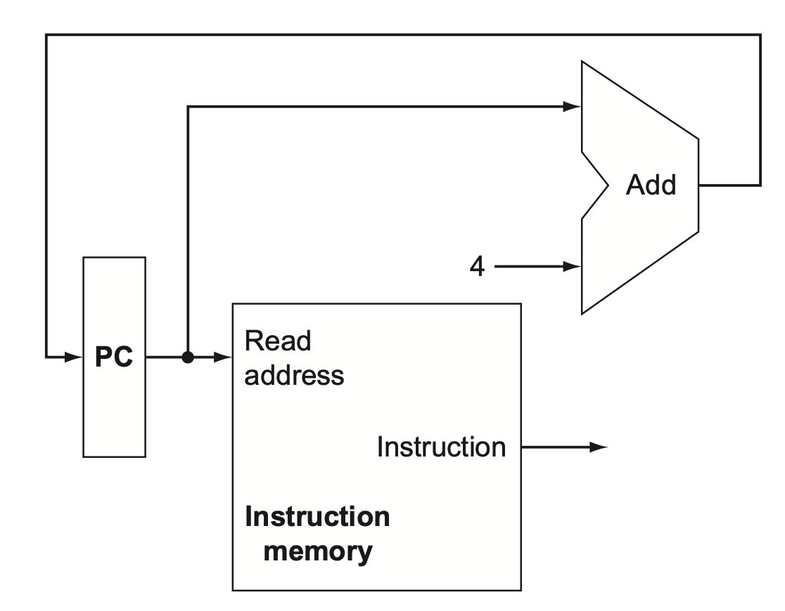

* The two elements needed to implement R-format **ALU operations** are the register file and the ALU.
    * 
    * The register file always outputs the contents of the registers corresponding to the Read register inputs on the outputs, no other control inputs are needed
    * Register write must be explicitly indicated by asserting the write control signal.
    * Since writes to the register file are edge-triggered, our design can legally read and write the same register within a clock cycle: the read will get the value written in an earlier clock cycle, while the value written will be available to a read in a subsequent clock cycle.

* The two units needed to implement **loads and stores**
    * 
    * The memory unit needs a read signal, since, unlike the register file, reading the value of an invalid address can cause problems
    * The sign extension unit has a 16-bit input that is **sign-extended** into a 32-bit result appearing on the output
    * sign extension is used to compute the result in each cycle:
        1. provide the `immediate` `ALU` operand for addi
        2. calculate the potential `address` in the `execution` for beq
        3. calculate the read `address` of `D-Mem` for lw
        4. calculate the `D-Mem` `address` but it is for write address for sw

* The datapath for a **branch** uses the ALU to evaluate the branch condition and a separate adder to compute the branch target as the sum of the incremented PC and the sign-extended, lower 16 bits of the instruction (the branch displacement), shifted left 2 bits.
    * 
    * **branch target address** The address specified in a branch, which becomes the new program counter (PC) if the branch is taken. In the MIPS architecture the branch target is given by the sum of the offset field of the instruction and the address of the instruction following the branch.
    * branch datapath must do two operations:
        1. compute the branch target address and
        2. compare the register contents.

* The simple datapath
    * 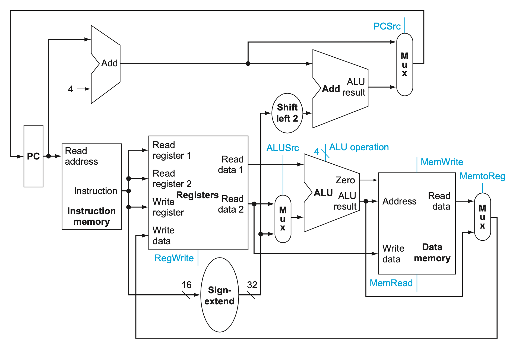

* [Dadapath](https://www.cise.ufl.edu/~mssz/CompOrg/CDA-proc.html) is the hardware that performs all the required operations, for example, ALU, registers, and internal buses.

## 4.4 A Simple Implementation Scheme

### The ALU Control
* For the R-type instructions, the ALU needs to perform one of the five actions (AND, OR, subtract, add, or set on less than), depending on the value of the 6-bit funct (or function) field in the low-order bits of the instruction.
* We can generate the 4-bit ALU control input using a small control unit that has as inputs the function field of the instruction and a 2-bit control field, which we call ALUOp. ALUOp indicates whether the operation to be performed should be add (00) for loads and stores, subtract (01) for beq, or determined by the operation encoded in the funct field (10).

    ```c++
    101011  00011 00010 0000000000 [0101 (00)]
    ALUOp ()
    ALU control []
    ```
* **Multi-level decoding** -- main control generates ALUop bits, which are input to ALU control. The ALU control then generates the three-bit codes
    * The advantage of a hierarchically partitioned or pipelined control scheme is realized in reduced hardware (several small control units are used instead of one large unit).
* 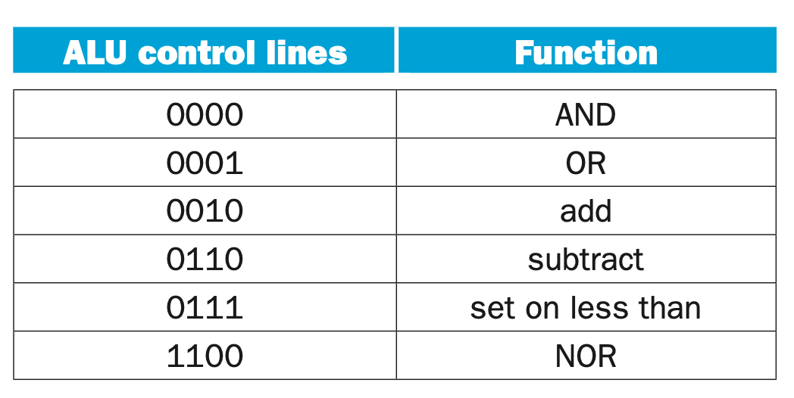
* 

### Designing the Main Control Unit
* 
* Instruction format for **R-format instructions**, which all have an opcode of 0. These instructions have three register operands: rs, rt, and rd. Fields rs and rt are sources, and rd is the destination. The ALU function is in the funct field and is decoded by the ALU control design in the previous section. The R-type instructions that we implement are add, sub, AND, OR, and slt. The shamt field is used only for shifts; we will ignore it in this chapter.

    ```c++
    add $<dst>,     $<src>,     immediate data
    sub $<dst>,     $<src>,     $<src>
    mul $<dst>,     $<src>,     $<src>
    and $<dst>,     $<src>,     $<src>
    or  $<dst>,     $<src>,     $<src>
    sll $<dst>,     $<src>,     immediate data
    srl $<dst>,     $<src>,     immediate data
    ```

* Instruction format for **load (opcode = 35ten) and store (opcode = 43ten)** instructions. The register rs is the base register that is added to the 16-bit address field to form the memory address. For loads, rt is the destination register for the loaded value. For stores, rt is the source register whose value should be stored into memory.

    ```c++
    lw $<dst>, offset($<src>)
    sw $<src>, offset($<dst>)
    ```
* Instruction format for **branch equal** (opcode =4). The registers rs and rt are the source registers that are compared for equality. The 16-bit address field is sign-extended, shifted, and added to the PC + 4 to compute the branch target address.

    ```c++
    beq $<src>, $<src>, branch offset
    ```

* 
* 
* 

### Operation of the Datapath
* The simple datapath with the control unit
    * 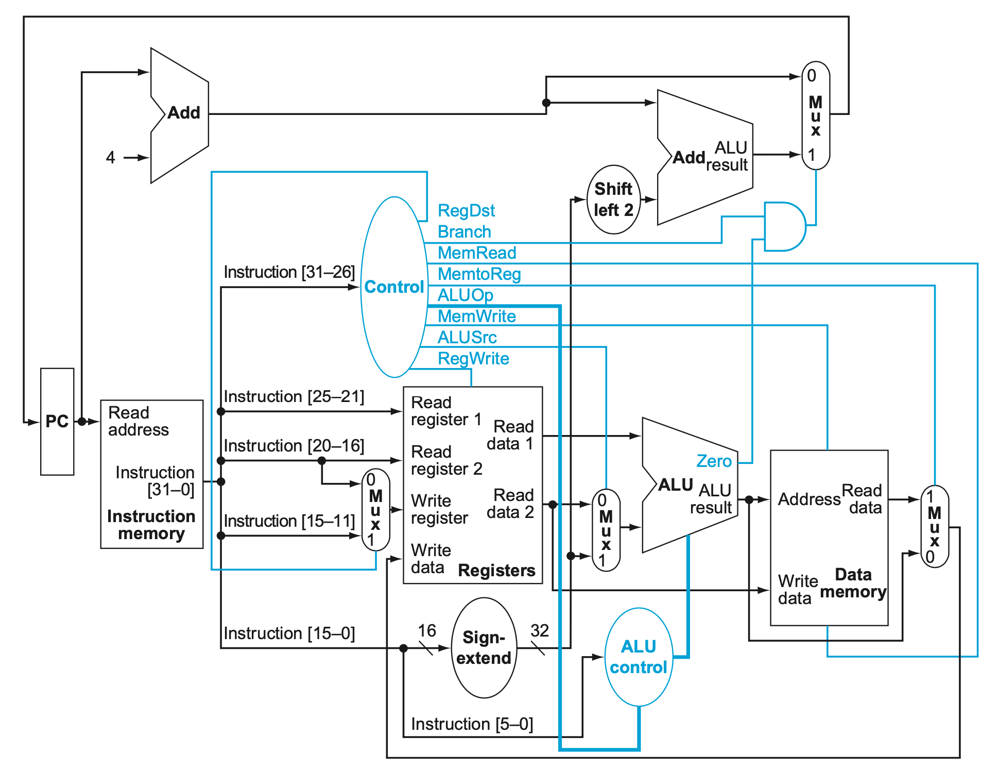
    * The input to the control unit is the 6-bit opcode field from the instruction
    * The outputs of the control unit consist of:
        * three 1-bit signals that are used to control multiplexors (RegDst, ALUSrc, and MemtoReg)
        * three signals for controlling reads and writes in the register file and data memory (RegWrite, MemRead, and MemWrite)
        * a 1-bit signal used in determining whether to possibly branch (Branch)
        * a 2-bit control signal for the ALU (ALUOp)
    * An AND gate is used to combine the branch control signal and the Zero output from the ALU; the AND gate output controls the selection of the next PC. Notice that PCSrc is now a derived signal, rather than one coming directly from the control unit.

* The datapath in operation for an R-type instruction
    1. (IF) The instruction is fetched, and the PC is incremented.
    2. (ID) Two registers, $t2 and $t3, are read from the register file; also, the main control unit computes the setting of the control lines during this step.
    3. (EX) The ALU operates on the data read from the register file, using the function code (bits 5:0, which is the funct field, of the instruction) to generate the ALU function.
    4. (WB) The result from the ALU is written into the register file using bits 15:11 of the instruction to select the destination register ($t1).

    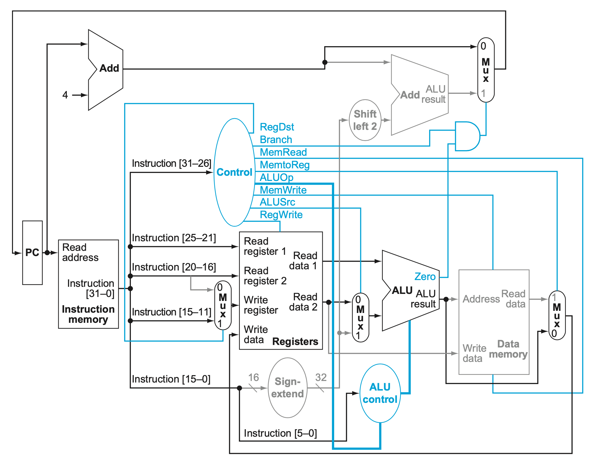

* The datapath in operation for a load instruction

    * 

* The datapath in operation for a branch-on-equal instruction
    * 

* The simple control and datapath are extended to handle the jump instruction
    * 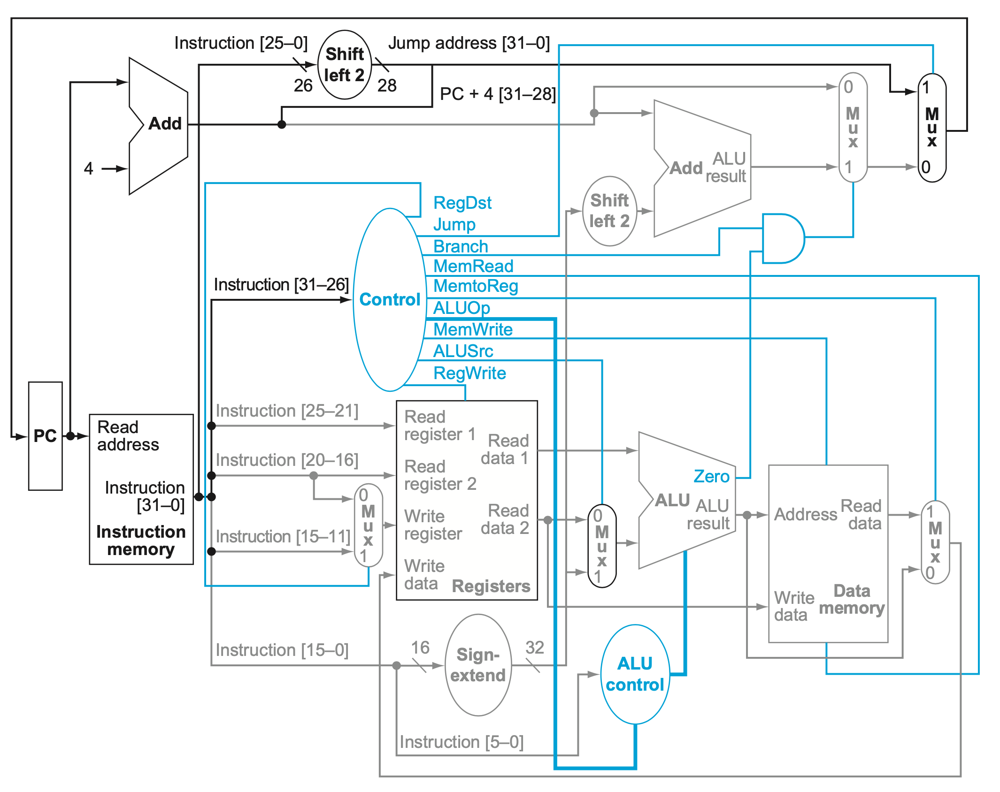
    * the low-order 2 bits of a jump address are always 00two. The next lower 26 bits of this 32-bit address come from the 26-bit immediate field in the instruction.
    * The upper 4 bits of the address that should replace the PC come from the PC of the jump instruction plus 4. Thus, we can implement a jump by storing into the PC the concatenation of:
        * the upper 4 bits of the current PC + 4 (these are bits 31:28 of the sequentially following instruction address)
        * the 26-bit immediate field of the jump instruction
        * the bits 00
        * 
    * The jump instruction operates by replacing the lower 28 bits of the PC with the lower 26 bits of the instruction **shifted left by 2 bits**.

* Why a Single-Cycle Implementation Is Not Used Today
    * the clock cycle must have the same length for every instruction in this single-cycle design. Of course, the longest possible path in the processor determines the clock cycle.

## 4.5 An Overview of Pipelining

All the pipeline stages take a single clock cycle, so the clock cycle must be long enough to accommodate the slowest operation.

We can turn the pipelining speed-up discussion above into a formula:
> [Time between instructions(pipelined)] = [Time between instructionnon(pipelined)] / [Number of pipe stages]
* Under ideal conditions and with a large number of instructions, the speed-up from pipelining is approximately equal to the number of pipe stages; a five-stage pipeline is nearly five times faster.


Pipelining improves performance by increasing instruction throughput, as opposed to decreasing the execution time of an individual instruction, but instruction throughput is the important metric because real programs execute billions of instructions.

Pipelining increases the number of simultaneously executing instructions and the rate at which instructions are started and completed. Pipelining does not reduce the time it takes to complete an individual instruction, also called the latency.

Pipelining improves instruction throughput rather than individual instruction execution time or latency.

**latency** (pipeline) The number of stages in a pipeline or the number of stages between two instructions during execution

### 4.5.1 Designing Instruction Sets for Pipelining
1. All MIPS instructions are the **same length**. This restriction makes it much easier to fetch instructions in the first pipeline stage and to decode them in the second stage.
2. MIPS has only a few instruction formats, with the source register fields being located in the same place in each instruction. This symmetry means that the second stage can begin reading the register file at the **same time** that the hardware is determining what type of instruction was fetched.
3. **Memory operands** only appear in loads or stores in MIPS. This restriction means we can use the execute stage to calculate the memory address and then access memory in the following stage.
4. Operands must be **aligned** in memory. Hence, we need not worry about a single data transfer instruction requiring two data memory accesses; the requested data can be transferred between processor and memory in a single pipeline stage.

### 4.5.2 Pipeline Hazards

#### Structural Hazard

It means that the hardware cannot support the combination of instructions that we want to execute in the same clock cycle.

#### Data Hazards

**Data hazard** when the pipeline must be stalled because one step must wait for another to complete.

**load-use data hazard** A specific form of data hazard in which the data being loaded by a load instruction has not yet become available when it is needed by another instruction.

**pipeline stall (bubble)** A stall initiated in order to resolve a hazard.

* Graphical representation of forwarding
    * 

* We need a stall even with forwarding when an R-format instruction following a load tries to use the data
    * 

How we can handle hard cases to avoid load-use pipeline stalls
1. using hardware detection
2. stalls
3. software that reorders code

#### Control Hazards

control hazard, arising from the need to make a decision based on the results of one instruction while others are executing.

**control hazard (branch hazard)** When the proper instruction cannot execute in the proper pipeline clock cycle because the instruction that was fetched is not the one that is needed; that
is, the flow of instruction addresses is not what the pipeline expected.

Two solutions to control hazards:
1. Stall.
    * Notice that we must begin fetching the instruction following the branch on the very next clock cycle. Nevertheless, the pipeline cannot possibly know what the next instruction should be, since it only just received the branch instruction from memory
    * 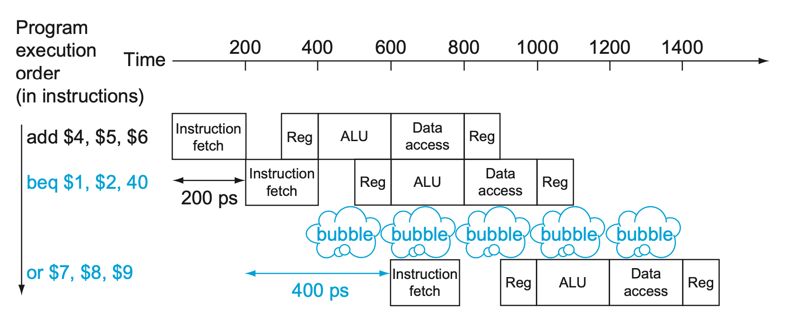
    * If we cannot resolve the branch in the second stage, as is often the case for longer pipelines, then we’d see an even larger slowdown if we stall on branches. The cost of this option is too high for most computers to use
2. Predict
    * This option does not slow down the pipeline when you are correct. When you are wrong, however, you need to redo the load that was washed while guessing the decision.
    * 
3. Delayed decision
    * The delayed branch always executes the next sequential instruction, with the branch taking place after that one instruction delay.
    * MIPS software will place an instruction immediately after the delayed branch instruction that is not affected by the branch, and a taken branch changes the address of the instruction that follows this safe instruction.

## 4.6 Pipelined Datapath and Control

The division of an instruction into five stages means a five-stage pipeline, which in turn means that up to five instructions will be in execution during any single clock cycle.
1. IF: Instruction fetch
2. ID: Instruction decode and register file read
3. EX: Execution or address calculation
4. MEM: Data memory access
5. WB: Write back to register

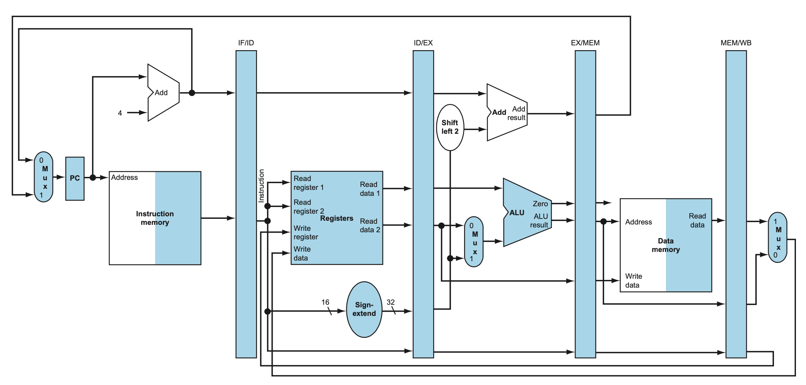


lw example
* 
    * This incremented address is also saved in the IF/ID pipeline register in case it is needed later for an instruction, such as beq. The computer cannot know which type of instruction is being fetched, so it must prepare for any instruction, passing potentially needed information down the pipeline.

* 
    * 16-bit immediate field, which is sign-extended to 32 bits, , and the register numbers to read the two registers. All three values are stored in the ID/EX pipeline register, along with the incremented PC address.

* 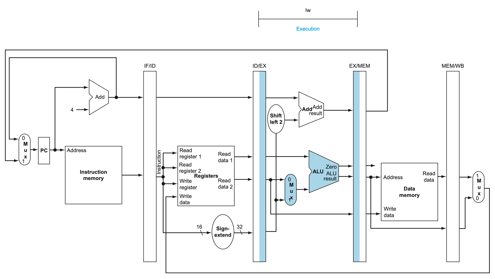
* 
* 


### 4.6.1 Graphically Representing Pipelines

multiple-clock-cycle

single-clock-cycle

### 4.6.2 Pipeline Control


1. Instruction fetch: The control signals to read instruction memory and to write the PC are always asserted, so there is nothing special to control in this pipeline stage.
2. Instruction decode/register file read: As in the previous stage, the same thing happens at every clock cycle, so there are no optional control lines to set.
3. Execution/address calculation: The signals to be set are RegDst, ALUOp, and ALUSrc (see Figures 4.47 and 4.48). The signals select the Result register, the ALU operation, and either Read data 2 or a sign-extended immediate for the ALU.
4. Memory access: The control lines set in this stage are Branch, MemRead, and MemWrite. The branch equal, load, and store instructions set these signals, respectively. Recall that PCSrc in Figure 4.48 selects the next sequential address unless control asserts Branch and the ALU result was 0.
5. Write-back: The two control lines are MemtoReg, which decides between sending the ALU result or the memory value to the register file, and Reg- Write, which writes the chosen value.


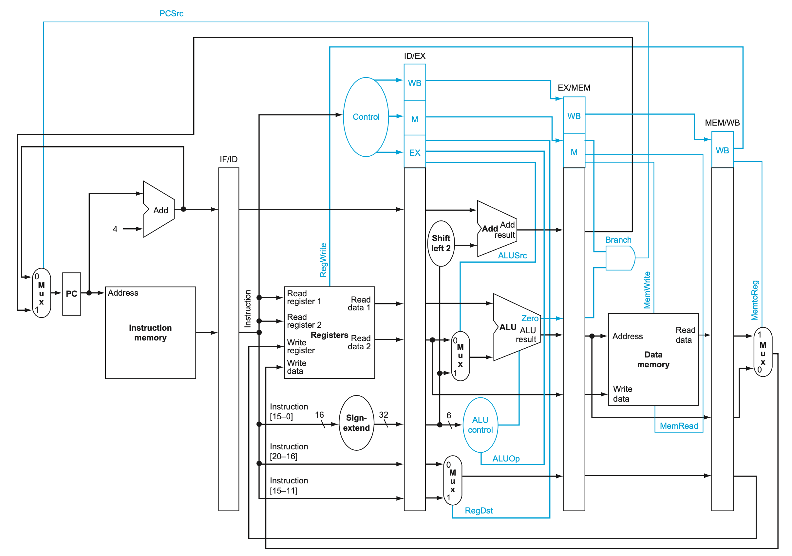
* Implementing control means setting the nine control lines to these values in each stage for each instruction. The simplest way to do this is to extend the pipeline registers to include control information.
* Since the control lines start with the EX stage, we can create the control information during instruction decode.

## 4.7 Data Hazards: Forwarding versus Stalling

```assembly
dependency hazard type:
1a. EX/MEM.RegisterRd = ID/EX.RegisterRs
1b. EX/MEM.RegisterRd = ID/EX.RegisterRt
2a. MEM/WB.RegisterRd = ID/EX.RegisterRs
2b. MEM/WB.RegisterRd = ID/EX.RegisterRt

sub   $2, $1,$3     #       Register $2 written by sub
and   $12,$2,$5     # 1a    1st operand($2) depends on sub
or    $13,$6,$2     # 2b    2nd operand($2) depends on sub
add   $14,$2,$2     #       1st($2) & 2nd($2) depend on sub
sw    $15,100($2)   #       Base ($2) depends on sub
```

* 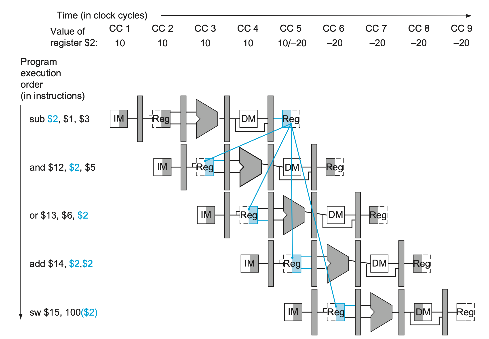
    * What happens when a register is read and written in the same clock cycle? We assume that the write is in the first half of the clock cycle and the read is in the second half, so the read delivers what is written. As is the case for many implementations of register files, we have no data hazard in this case.
    * the value of register $2, which changes during the middle of clock cycle 5, when the sub instruction writes its result.
    * only add and sw instructions would get correct value of $2
    * the desired result is available at the end of the EX stage or clock cycle 3. When is the data actually needed by the AND and OR instructions? At the beginning of the EX stage, or clock cycles 4 and 5, respectively. Thus, we can execute this segment without stalls if we simply forward the data as soon as it is available to any units that need it before it is available to read from the register file.

**Avoid unnecessary forwading** Because some instructions do not write registers, this policy is inaccurate; sometimes it would forward when it shouldn’t. One solution is simply to check to see if the RegWrite signal will be active: examining the WB control field of the pipeline register during the EX and MEM stages determines whether RegWrite is asserted.

If we can take the inputs to the ALU from `any pipeline register` rather than just ID/EX, then we can forward the proper data. By adding multiplexors to the input of the ALU, and with the proper controls, we can run the pipeline at full speed in the presence of these data dependences.

This forwarding control will be in the `EX stage`, because the ALU forwarding multiplexors are found in that stage. Thus, we must pass the operand register numbers from the ID stage via the ID/EX pipeline register to determine whether to forward values.

* 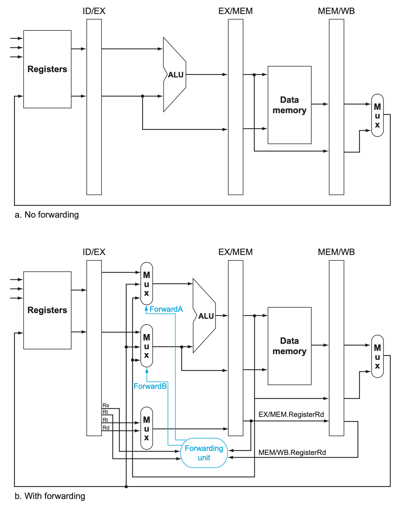
* 

* EX hazard:

    ```c++
    if (EX/MEM.RegWrite
        and (EX/MEM.RegisterRd != 0)
        and (EX/MEM.RegisterRd = ID/EX.RegisterRs)
    ) ForwardA = 10

    if (EX/MEM.RegWrite
        and (EX/MEM.RegisterRd != 0)
        and (EX/MEM.RegisterRd = ID/EX.RegisterRt)
    ) ForwardB = 10
    ```

* MEM hazard:

    ```c++
    if (MEM/WB.RegWrite
        and (MEM/WB.RegisterRd !=  0)
        and (MEM/WB.RegisterRd = ID/EX.RegisterRs)
    ) ForwardA = 01
    
    if (MEM/WB.RegWrite
        and (MEM/WB.RegisterRd !=  0)
        and (MEM/WB.RegisterRd = ID/EX.RegisterRt)
    ) ForwardB = 01
    ```

One complication is potential data hazards between the result of the instruction in the WB stage, the result of the instruction in the MEM stage, and the source operand of the instruction in the ALU stage. For example, when summing a vector of numbers in a single register, a sequence of instructions will all read and write to the same register:
```c++
add $1,$1,$2
add $1,$1,$3
add $1,$1,$4

if (MEM/WB.RegWrite
    and (MEM/WB.RegisterRd !=  0)
    and not(EX/MEM.RegWrite and (EX/MEM.RegisterRd !=  0)
        and (EX/MEM.RegisterRd !=  ID/EX.RegisterRs)
    )
    and (MEM/WB.RegisterRd = ID/EX.RegisterRs)
) ForwardA = 01

if (MEM/WB.RegWrite
    and (MEM/WB.RegisterRd !=  0)
    and not(EX/MEM.RegWrite and (EX/MEM.RegisterRd !=  0)
        and (EX/MEM.RegisterRd !=  ID/EX.RegisterRt)
    )
    and (MEM/WB.RegisterRd = ID/EX.RegisterRt)
) ForwardB = 01
```

Note that the EX/MEM.RegisterRd field is the register destination for either an ALU instruction (which comes from the Rd field of the instruction) or a load (which comes from the Rt field).

* 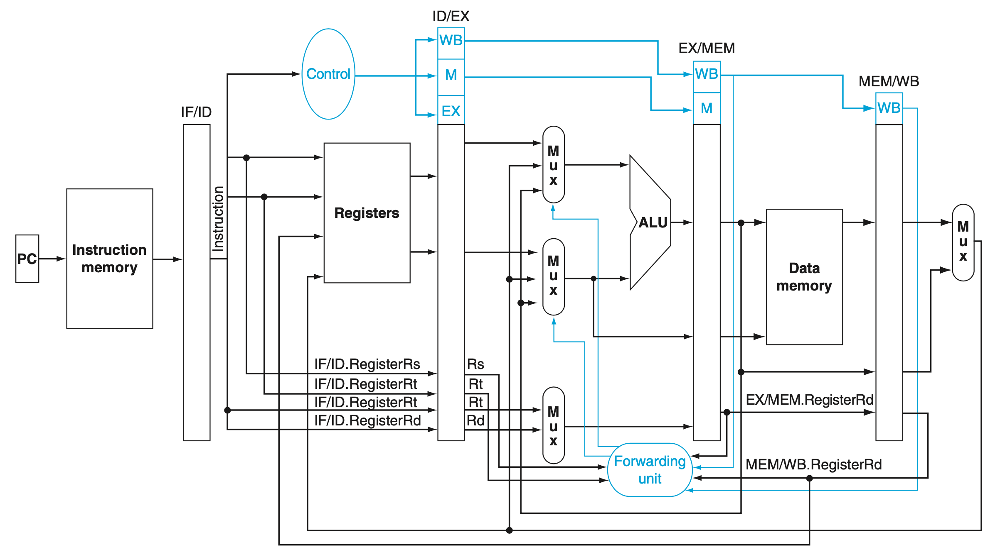
    * the additions are the multiplexors to the inputs to the ALU.
    * 

### 4.7.1 Data Hazards and Stalls

one case where forwarding cannot save the day is when an instruction tries to read a register following a load instruction that writes the same register.

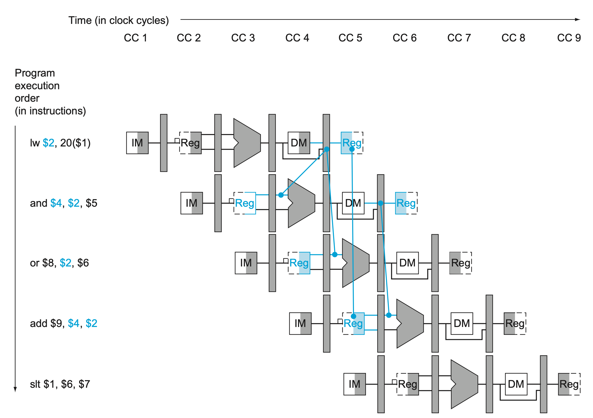
* Since the dependence between the load and the following instruction (and) goes backward in time, this hazard cannot be solved by forwarding. Hence, this combination must result in a stall by the hazard detection unit.

```c++
if (ID/EX.MemRead
    and ((ID/EX.RegisterRt = IF/ID.RegisterRs)
        or (ID/EX.RegisterRt = IF/ID.RegisterRt)
    )
) stall the pipeline
```

If the instruction in the ID stage is stalled, then the instruction in the IF stage must also be stalled; otherwise, we would lose the fetched instruction. Preventing these two instructions from making progress is accomplished simply by preventing the PC register and the IF/ID pipeline register from changing. Provided these registers are preserved, the instruction in the IF stage will continue to be read using the same PC, and the registers in the ID stage will continue to be read using the same instruction fields in the IF/ID pipeline register.

**Deasserting all nine control signals (setting them to 0) in the EX, MEM, and WB stages will create a “do nothing” or nop instruction.** By identifying the hazard in the ID stage, we can insert a bubble into the pipeline by changing the EX, MEM, and WB control fields of the ID/EX pipeline register to 0

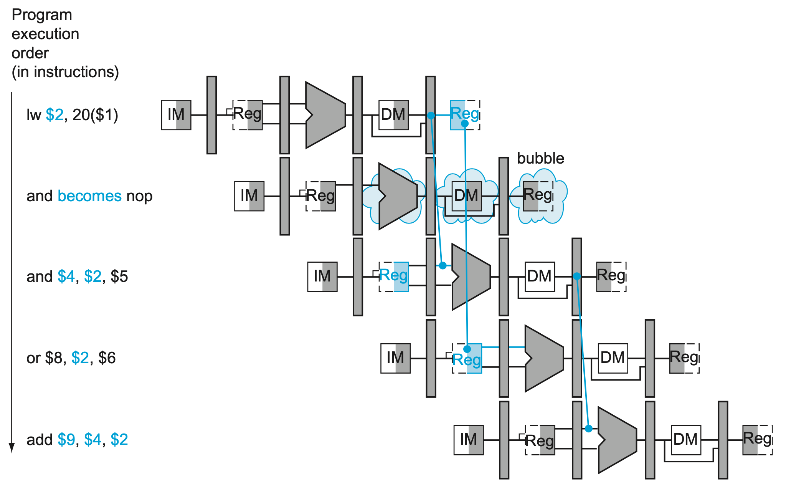


* The forwarding unit controls the ALU multiplexors to replace the value from a general-purpose register with the value from the proper pipeline register.
* The hazard detection unit controls the writing of the PC and IF/ID registers plus the multiplexor that chooses between the real control values and all 0s. The hazard detection unit stalls and deasserts the control fields if the load-use hazard test above is true

## 4.8 Control Hazards

An instruction must be fetched at every clock cycle to sustain the pipeline, yet in our design the decision about whether to branch doesn’t occur until the MEM pipeline stage.

### Assume Branch Not Taken

One improvement over branch stalling is to predict that the branch will not be taken and thus continue execution down the sequential instruction stream. If the branch is taken, the instructions that are being fetched and decoded must be discarded.

To discard instructions, we merely change the original control values to 0s, much as we did to stall for a load-use data hazard. The difference is that we must also change the three instructions in the IF, ID, and EX stages when the branch reaches the MEM stage; for load-use stalls, we just change control to 0 in the ID stage and let them percolate through the pipeline. Discarding instructions, then, means we must be able to flush instructions in the IF, ID, and EX stages of the pipeline.

### Reducing the Delay of Branches

One way to improve branch performance is to reduce the cost of the taken branch.

The MIPS architecture was designed to support fast single-cycle branches that could be pipelined with a small branch penalty.

The designers observed that many branches rely only on simple tests (equality or sign, for example) and that such tests do not require a full ALU operation but can be done with at most a few gates. When a more complex branch decision is required, a separate instruction that uses an ALU to perform a comparison is required - a situation that is similar to the use of condition codes for branches.

Moving the branch decision up requires two actions to occur earlier: computing the branch target address and evaluating the branch decision:
1. The easy part of this change is to move up the branch address calculation. We already have the PC value and the immediate field in the IF/ID pipeline register, so we just move the branch adder from the EX stage to the ID stage.
2. To implement branch on equal (and its inverse), we will need to forward results to the equality test logic that operates during ID. There are two complicating factors:
    * During ID, we must decode the instruction, decide whether a bypass to the equality unit is needed, and complete the equality comparison so that if the instruction is a branch, we can set the PC to the branch target address. Forwarding for the operands of branches was formerly handled by the ALU forwarding logic, but the introduction of the equality test unit in ID will require new forwarding logic. Note that the bypassed source operands of a branch can come from either the ALU/MEM or MEM/WB pipeline latches.
    * Because the values in a branch comparison are needed during ID but may be produced later in time, it is possible that a data hazard can occur and a stall will be needed.

Despite these difficulties, moving the branch execution to the ID stage is an improvement, because it reduces the penalty of a branch to only one instruction if the branch is taken, namely, the one currently being fetched.

To flush instructions in the IF stage, we add a control line, called **IF.Flush**, that zeros the instruction field of the IF/ID pipeline register. Clearing the register transforms the fetched instruction into a `nop`, an instruction that has no action and changes no state.

Example
```c++
36 sub  $10, $4, $8
40 beq  $1,  $3, 7    # PC-relative branch to 40+4+7*4=72
44 and  $12, $2, $5
48 or   $13, $2, $6
52 add  $14, $4, $2
56 slt  $15, $6, $7
...
72 lw   $4,  50($7)
```


* The ID stage of clock 3 determines that a branch must be taken, so it selects 72 as the next PC address and zeros the instruction fetched for the next clock cycle
*  Clock cycle 4 shows the instruction at location 72 being fetched and the single bubble or nop instruction in the pipeline as a result of the taken branch.

### Dynamic Branch Prediction

**Dynamic branch prediction** Prediction of branches at runtime using runtime information.

**Branch prediction buffer** Also called branch history table. A small memory that is indexed by the lower portion of the address of the branch instruction and that contains one or more bits indicating whether the branch was recently taken or not.

One approach is to look up the address of the instruction to see if a branch was taken the last time this instruction was executed, and, if so, to begin fetching new instructions from the same place as the last time. This technique is called `dynamic branch prediction`.

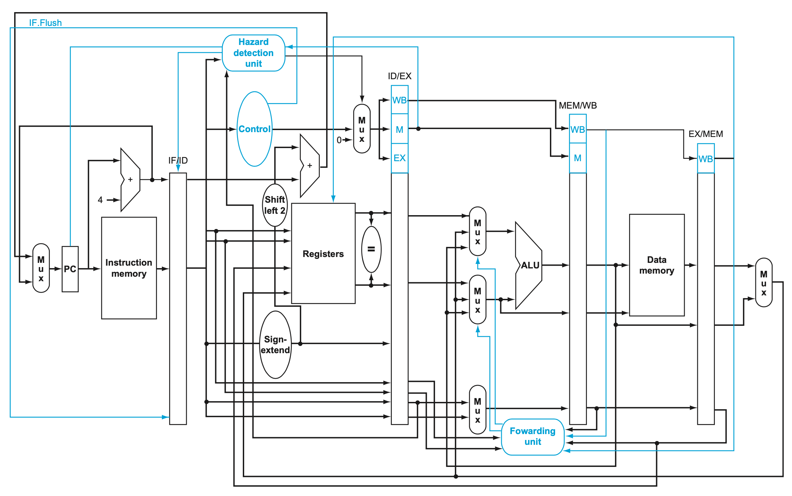

## 4.9 Exceptions

Control is the most challenging aspect of processor design: it is both the hardest part to get right and the hardest part to make fast.

One of the hardest parts of control is implementing exceptions and interrupts - events other than branches or jumps that change the normal flow of instruction execution. They were initially created to handle unexpected events from within the processor, like arithmetic overflow. The same basic mechanism was extended for I/O devices to communicate with the processor.

Detecting exceptional conditions and taking the appropriate action is often on the critical timing path of a processor, which determines the clock cycle time and thus performance.

There are two main methods used to communicate the reason for an exception:
1. status register
2. vectored interrupt. An interrupt for which the address to which control is transferred is determined by the cause of the exception.

A pipelined implementation treats exceptions as another form of control hazard.


* A new control signal, called **ID.Flush**, is ORed with the stall signal from the hazard detection unit to flush during ID
* To flush the instruction in the EX phase, we use a new signal called **EX.Flush** to cause new multiplexors to zero the control lines
* The key additions include a new input with the value 8000 0180hex in the multiplexor that supplies the new PC value; a Cause register to record the cause of the exception; and an Exception PC register to save the address of the instruction that caused the exception.

The overflow exception is detected during the **EX stage**; hence, we can use the EX.Flush signal to prevent the instruction in the EX stage from writing its result in the WB stage.

* Example
    * ```c++
        80000180hex sw $26, 1000($0)
        80000184hex sw $27, 1004($0)
        ````
    * 
    * The overflow is detected during the EX stage of clock 6, saving the address following the add in the EPC register (4C + 4 = 50hex).
    * Overflow causes all the Flush signals to be set near the end of this clock cycle, deasserting control values (setting them to 0) for the add.
    * Clock cycle 7 shows the instructions converted to bubbles in the pipeline plus the fetching of the first instruction of the exception routine - sw $25,1000($0) - from instruction location 8000 0180hex.
    * Note that the AND and OR instructions, which are prior to the add, still complete. Although not shown, the ALU overflow signal is an input to the control unit.

With five instructions active in any clock cycle, the challenge is to associate an exception with the appropriate instruction. Moreover, multiple exceptions can occur simultaneously in a single clock cycle. The solution is to prioritize the exceptions so that it is easy to determine which is serviced first. In most MIPS implementations, the hardware sorts exceptions so that the earliest instruction is interrupted.

The hardware and the operating system must work in conjunction so that exceptions behave as you would expect.
1. The `hardware` contract is normally to stop the offending instruction in midstream, let all prior instructions complete, flush all following instructions, set a register to show the cause of the exception, save the address of the offending instruction, and then jump to a prearranged address.
2. The `operating system` contract is to look at the cause of the exception and act appropriately.

## 4.10 Parallelism via Instructions

Pipelining exploits the potential parallelism among instructions. This parallelism is called instruction-level parallelism (ILP).

There are two primary methods for increasing the potential amount of instruction-level parallelism:
1. increasing the depth of the pipeline to overlap more instructions
2. **multiple issue** replicate the internal components of the computer so that it can launch multiple instructions in every pipeline stage

There are two major ways to implement a multiple-issue processor, with the major difference being the division of work between the compiler and the hardware:
1. **static multiple issue** An approach to implementing a multiple-issue processor where many decisions are made by the compiler before execution.
2. **dynamic multiple issue** An approach to implementing a multiple- issue processor where many decisions are made during execution by the processor.

There are two primary and distinct responsibilities that must be dealt with in a multiple-issue pipeline:
1. Packaging instructions into issue slots: how does the processor determine how many instructions and which instructions can be issued in a given clock cycle? In most static issue processors, this process is at least partially handled by the compiler; in dynamic issue designs, it is normally dealt with at runtime by the processor, although the compiler will often have already tried to help improve the issue rate by placing the instructions in a beneficial order.
2. Dealing with data and control hazards: in static issue processors, the compiler handles some or all of the consequences of data and control hazards statically. In contrast, most dynamic issue processors attempt to alleviate at least some classes of hazards using hardware techniques operating at execution time.

`issue slots` The positions from which instructions could issue in a given clock cycle; by analogy, these correspond to positions at the starting blocks for a sprint.

### The Concept of Speculation

**speculation** An approach whereby the compiler or processor guesses the outcome of an instruction to remove it as a dependence in executing other instructions.

The difficulty with speculation is that it may be wrong. So, any speculation mechanism must include both:
1. a method to check if the guess was right
2. and a method to unroll or back out the effects of the instructions that were executed speculatively.

Speculation may be done in the compiler or by the hardware:
1. The compiler can use speculation to reorder instructions, moving an instruction across a branch or a load across a store.
2. The processor hardware can perform the same transformation at runtime using techniques we discuss later in this section.

The recovery mechanisms used for incorrect speculation are rather different:
1. In software, the compiler usually inserts additional instructions that check the accuracy of the speculation and provide a fix-up routine to use when the speculation is incorrect.
2. In hardware, the processor usually buffers the speculative results until it knows they are no longer speculative. If the speculation is correct, the instructions are completed by allowing the contents of the buffers to be written to the registers or memory. If the speculation is incorrect, the hardware flushes the buffers and re-executes the correct instruction sequence.

### Static Multiple Issue

**issue packet** The set of instructions that issues together in one clock cycle; the packet may be determined statically by the compiler or dynamically by the processor.

Since a static multiple-issue processor usually restricts what mix of instructions can be initiated in a given clock cycle, it is useful to think of the issue packet as a single instruction allowing several operations in certain predefined fields. This view led to the original name for this approach: **Very Long Instruction Word (VLIW)**.

#### 2 Multiple Issue Example
*  Issuing two instructions per cycle will require fetching and decoding 64 bits of instructions.
* In many static multiple-issue processors, and essentially all VLIW processors, the layout of simultaneously issuing instructions is restricted to simplify the decoding and instruction issue
* we will require that the instructions be paired and aligned on a 64-bit boundary, with the ALU or branch portion appearing first
* if one instruction of the pair cannot be used, we require that it be replaced with a nop
* Static multiple-issue processors vary in how they deal with potential data and control hazards. In some designs, the compiler takes full responsibility for removing all hazards, scheduling the code and inserting no-ops so that the code executes without any need for hazard detection or hardware-generated stalls. In others, the hardware detects data hazards and generates stalls **between** two issue packets, while requiring that the compiler avoid all dependences **within** an instruction pair.
* 
* 
    * The additions needed for double issue are highlighted: another 32 bits from instruction memory, two more read ports and one more write port on the register file, and another ALU.
* two-issue processor can improve performance by up to a factor of two. Doing so, however, requires that twice as many instructions be overlapped in execution, and this additional overlap increases the relative performance loss from data and control hazards.
    * loads have a use latency of one clock cycle, which prevents one instruction from using the result without stalling. In the two-issue, five-stage pipeline the result of a load instruction cannot be used on the next clock cycle. This means that the next two instructions cannot use the load result without stalling.
    * ```c++
        Loop: lw    $t0, 0($s1)         # $t0=array element
              addu  $t0, $t0,   $s2     # add scalar in $s2
              sw    $t0, 0($s1)         # store result
              addi  $s1, $s1,   -4      # decrement pointer
              bne   $s1, $zero, Loop    # branch $s1!=0
        ```
        * The first three instructions have data dependences, and so do the last two
        * Reorder the instructions to avoid as many pipeline stalls as possible
        * 
        * Notice that just one pair of instructions has both issue slots used.
        * It takes four clocks per loop iteration; at four clocks to execute five instructions, we get the disappointing CPI of 0.8 versus the best case of 0.5., or an IPC of 1.25 versus 2.0.
    * Loop Unrolling
        * 
        * That 12 of the 14 instructions in the loop execute as pairs. It takes 8 clocks for 4 loop iterations, or 2 clocks per iteration, which yields a CPI of 8/14 = 0.57. Loop unrolling and scheduling with dual issue gave us an improvement factor of almost 2, partly from reducing the loop control instructions and partly from dual issue execution. The cost of this performance improvement is using four temporary registers rather than one, as well as a significant increase in code size.


**use latency** Number of clock cycles between a load instruction and an instruction that can use the result of the load without stalling the pipeline.

**loop unrolling** A technique to get more performance from loops that access arrays, in which multiple copies of the loop body are made and instructions from different iterations are

**register renaming** The renaming of registers by the compiler or hardware to remove antidependences.

**antidependence** Also called **name dependence**. An ordering forced by the reuse of a name, typically a register, rather than by a true dependence that carries a value between two instructions.

### Dynamic Multiple-Issue Processors

Dynamic multiple-issue processors are also known as **superscalar**. An advanced pipelining technique that enables the processor to execute more than one instruction per clock cycle by selecting them during execution.

Achieving good performance on such a processor still requires the compiler to try to schedule instructions to move dependences apart and thereby improve the instruction issue rate

**dynamic pipeline scheduling** Hardware support for reordering the order of instruction execution so as to avoid stalls.

Many superscalars extend the basic framework of dynamic issue decisions to include dynamic pipeline scheduling. It chooses which instructions to execute in a given clock cycle while trying to avoid hazards and stalls.

```c++
lw     $t0, 20($s2)
addu   $t1, $t0,    $t2
sub    $s4, $s4,    $t3
slti   $t5, $s4,    20
```

Even though the sub instruction is ready to execute, it must wait for the lw and addu to complete first, which might take many clock cycles if memory is slow. Even though the sub instruction is ready to execute, it must wait for the lw and addu to complete first, which might take many clock cycles if memory is slow.

The pipeline is divided into three major units: an instruction fetch and issue unit, multiple functional units and a commit unit.


As soon as the buffer contains all its operands and the functional unit is ready to execute, the result is calculated. When the result is completed, it is sent to any reservation stations waiting for this particular result as well as to the commit unit, which buffers the result until it is safe to put the result into the register file or, for a store, into memory.

The buffer in the commit unit, often called the reorder buffer, is also used to supply operands, in much the same way as forwarding logic does in a statically scheduled pipeline.

**commit unit** The unit in a dynamic or out-of-order execution pipeline that decides when it is safe to release the result of an operation to programmer- visible registers and memory.

**reservation station** A buffer within a functional unit that holds the operands and the operation.

**reorder buffer** The buffer that holds results in a dynamically scheduled processor until it is safe to store the results to memory or a register.

To see how this conceptually works, consider the following steps:
1. When an instruction issues, it is copied to a reservation station for the appropriate functional unit. Any operands that are available in the register file or reorder buffer are also immediately copied into the reservation station.
2. If an operand is not in the register file or reorder buffer, it must be waiting to be produced by a functional unit. The name of the functional unit that will produce the result is tracked. When that unit eventually produces the result, it is copied directly into the waiting reservation station from the functional unit bypassing the registers.

Conceptually, you can think of a dynamically scheduled pipeline as analyzing the data flow structure of a program. The processor then executes the instructions in some order that preserves the data flow order of the program. This style of execution is called an out-of-order execution, since the instructions can be executed in a different order than they were fetched.

**out-of-order execution** A situation in pipelined execution when an instruction blocked from executing does
not cause the following instructions to wait.

**in-order commit** A commit in which the results of pipelined execution are written to the programmer visible state in the same order that instructions are fetched.

If an exception occurs, the computer can point to the last instruction executed, and the only registers updated will be those written by instructions before the instruction causing the exception.

Although the front end (fetch and issue) and the back end (commit) of the pipeline run in order, the functional units are free to initiate execution whenever the data they need is available.

Because the instructions are committed in order, we know whether or not the branch was correctly predicted before any instructions from the predicted path are committed.

Given that compilers can also schedule code around data dependences, you might ask why a superscalar processor would use dynamic schedulin:
1. not all stalls are predictable. In particular, cache misses (see Chapter 5) in the memory hierarchy cause unpredictable stalls. Dynamic scheduling allows the processor to hide some of those stalls by continuing to execute instructions while waiting for the stall to end.
2. if the processor speculates on branch outcomes using dynamic branch prediction, it cannot know the exact order of instructions at compile time, since it depends on the predicted and actual behavior of branches. Incorporating dynamic speculation to exploit more instruc tion-level parallelism (ILP) without incorporating dynamic scheduling would significantly restrict the benefits of speculation.
3. as the pipeline latency and issue width change from one implementation to another, the best way to compile a code sequence also changes.
    * how to schedule a sequence of dependent instructions is affected by both issue width and latency
    * The pipeline structure affects both the number of times a loop must be unrolled to avoid stalls as well as the process of compiler-based register renaming.
    * Dynamic scheduling allows the hardware to hide most of these details.


Both pipelining and multiple-issue execution increase peak instruction throughput and attempt to exploit instruction-level parallelism (ILP). Data and control dependences in programs, however, offer an upper limit on sustained performance because the processor must sometimes wait for a dependence to be resolved. Software-centric approaches to exploiting ILP rely on the ability of the compiler to find and reduce the effects of such dependences, while hardware-centric approaches rely on extensions to the pipeline and issue mechanisms. Speculation, performed by the compiler or the hardware, can increase the amount of ILP that can be exploited via prediction, although care must be taken since speculating incorrectly is likely to reduce performance.

## 4.11 Real Stuff: The ARM Cortex-A8 and Intel Core i7 Pipelines

## 4.12 Going Faster: Instruction-Level Parallelism and Matrix Multiply

## 4.13 Advanced Topic: An Introduction to Digital Design Using a Hardware Design Language to Describe and Model a Pipeline and More Pipelining Illustrations

## 4.14 Fallacies and Pitfalls
Many of the difficulties of pipelining arise because of instruction set complications:
1. Widely variable instruction lengths and running times can lead to imbalance among pipeline stages and severely complicate hazard detection in a design pipelined at the instruction set level.
2. Sophisticated addressing modes can lead to different sorts of problems.

## 4.15 Concluding Remarks

`Pipelining` improves throughput but not the inherent execution time, or instruction latency, of instructions; for some instructions, the latency is similar in length to the single-cycle approach

`Multiple instruction issue` adds additional datapath hardware to allow multiple instructions to begin every clock cycle, but at an increase in effective latency. `Pipelining` was presented as reducing the clock cycle time of the simple single-cycle datapath. Multiple instruction issue, in comparison, clearly focuses on reducing clock cycles per instruction (CPI).

The presence of data and control dependences, which can become `hazards`, are the primary limitations on how much parallelism can be exploited.

`Scheduling` and `speculation` via `prediction`, both in hardware and in software, are the primary techniques used to reduce the performance impact of dependences.


## 4.16 Historical Perspective and Further Reading

## Reference
* [4. Processors - Computer Organization and Design (2009)](https://www.cise.ufl.edu/~mssz/CompOrg/CDA-proc.html)

# Solution

https://github.com/dmohindru/cod5e

https://www3.ntu.edu.sg/home/smitha/fyp_gerald/rDatapath.html