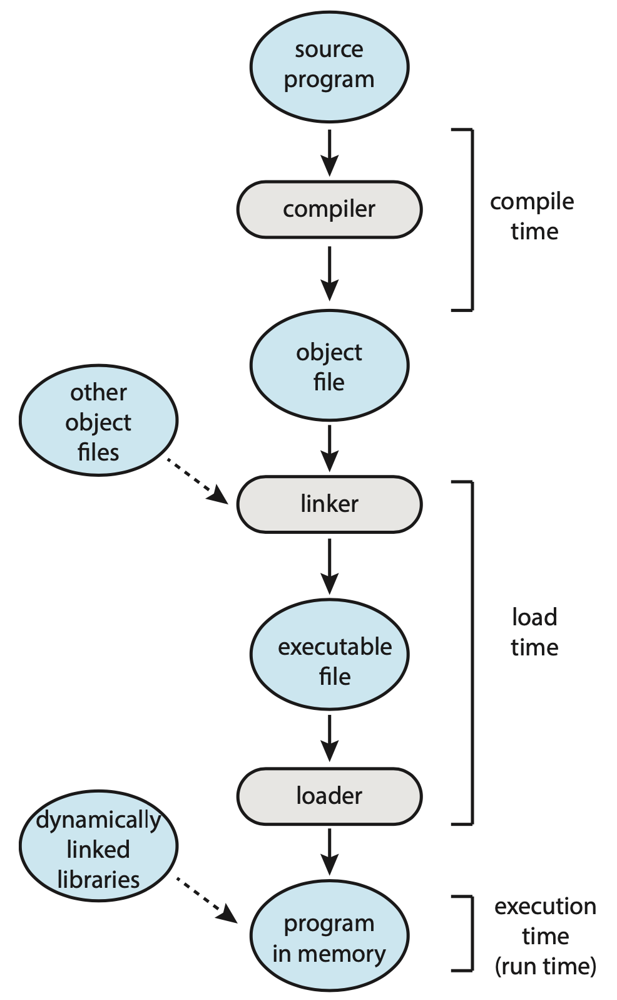

# Part 4 MEMORY MANAGEMENT

 Selection of a memory-management scheme for a system depends on many factors, especially on the system’s hardware design. Most algorithms require some form of hardware support.

## 9 Main Memory
### 9.1 Background
#### 9.1.1 Basic Hardware

For proper system operation, we must protect the operating system from access by user pro- cesses, as well as protect user processes from one another.

This protection must be provided by the hardware, because the operating system doesn’t usually intervene between the CPU and its memory accesses (because of the resulting performance penalty).

#### 9.1.2 Address Binding

The binding of instructions and data to memory addresses can be done at any step along the way:
1. **Compile time**. If you know at compile time where the process will reside in memory, then **absolute code** can be generated.
2. **Load time**e.If it is not known at compile time where the process will reside in memory, then the compiler must generate **relocatable code**.
3. **Execution time**.If the process can be moved during its execution from one memory segment to another, then binding must be delayed until run time.

#### 9.1.3 Logical Versus Physical Address Space

An address generated by the CPU is commonly referred to as a **logical address**, whereas an address seen by the memory unit - that is, the one loaded into the memory-address register of the memory - is commonly referred to as a **physical address**.

#### 9.1.4 Dynamic Loading

With dynamic loading, a routine is not loaded until it is called. All routines are kept on disk in a relocatable load format. The main program is loaded into memory and is executed.

The advantage of dynamic loading is that a routine is loaded only when it is needed. This method is particularly useful when large amounts of code are needed to handle infrequently occurring cases, such as error routines.

Dynamic loading does not require special support from the operating system. It is the responsibility of the users to design their programs to take advantage of such a method. Operating systems may help the programmer, however, by providing library routines to implement dynamic loading.

#### 9.1.5 Dynamic Linking and Shared Libraries

Dynamically linked libraries (DLLs) are system libraries that are linked to user programs when the programs are run.

Dynamic linking, in contrast, is similar to dynamic loading. Here, though, linking, rather than loading, is postponed until execution time.

Without this facility, each program on a system must include a copy of its language library (or at least the routines referenced by the program) in the executable image. This requirement not only increases the size of an executable image but also may waste main memory. A second advantage of DLLs is that these libraries can be shared among multiple processes, so that only one instance of the DLL in main memory.

When a program references a routine that is in a dynamic library, the loader locates the DLL, loading it into memory if necessary. It then adjusts addresses that reference functions in the dynamic library to the location in memory where the DLL is stored.

Unlike dynamic loading, dynamic linking and shared libraries generally require help from the operating system. If the processes in memory are pro- tected from one another, then the operating system is the only entity that can check to see whether the needed routine is in another process’s memory space or that can allow multiple processes to access the same memory addresses.

### 9.2 Contiguous Memory Allocation

#### 9.2.1 Memory Protection

#### 9.2.1 Memory Protection

#### 9.2.2 Memory Allocation

#### 9.2.3 Fragmentation

One solution to the problem of external fragmentation is compaction.

Another possible solution to the external-fragmentation problem is to per- mit the logical address space of processes to be noncontiguous, thus allowing a process to be allocated physical memory wherever such memory is available.

### 9.3 Paging

Paging avoids external fragmentation and the associated need for compaction, two problems that plague contiguous memory allocation.

#### 9.3.1 Basic Method

When we use a paging scheme, we have no external fragmentation: any free frame can be allocated to a process that needs it.

If process size is independent of page size, we expect internal fragmen- tation to average one-half page per process. This consideration suggests that small page sizes are desirable. However, overhead is involved in each page- table entry, and this overhead is reduced as the size of the pages increases. Also, disk I/O is more efficient when the amount of data being transferred is larger

#### 9.3.2 Hardware Support

### 9.4 Structure of the Page Table

### 9.5 Swapping
### 9.6 Example: Intel 32- and 64-bit Architectures
### 9.7 Example: ARMv8 Architecture
### 9.8 Summary

## 10 Virtual Memory
### 10.1 Background
### 10.2 Demand Paging
### 10.3 Copy-on-Write
### 10.4 Page Replacement
### 10.5 Allocation of Frames
### 10.6 Thrashing
### 10.7 Memory Compression
### 10.8 Allocating Kernel Memory
### 10.9 Other Considerations
### 10.10 Operating-System Examples