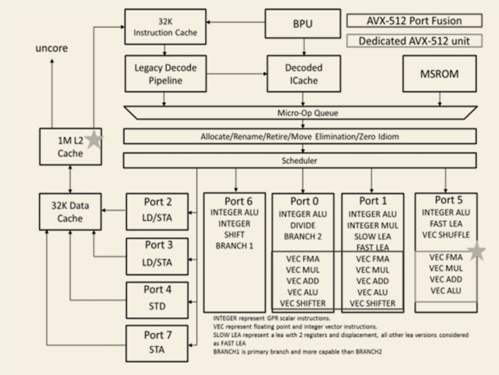
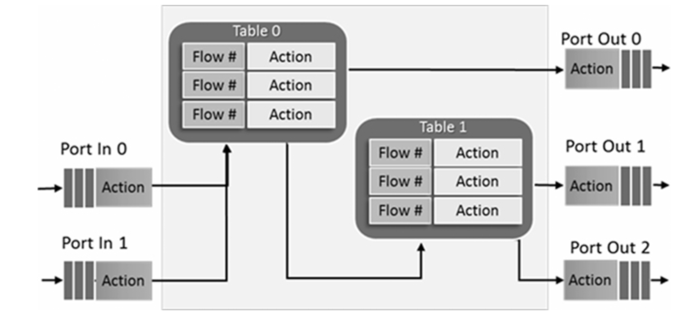
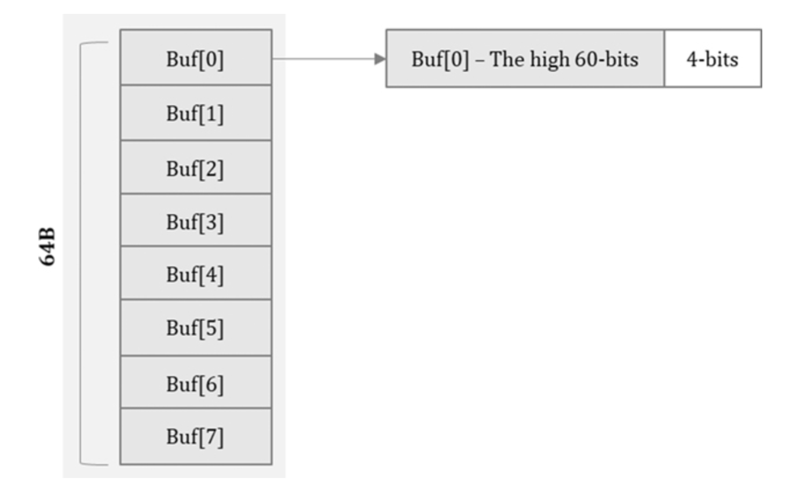
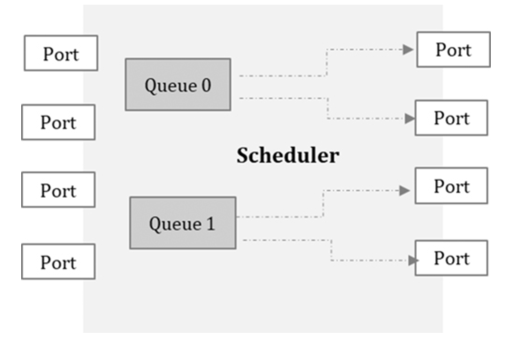
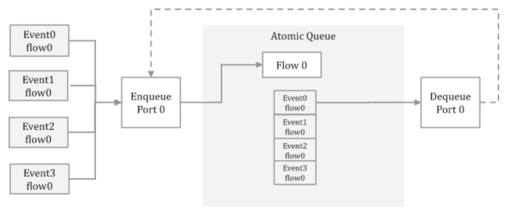
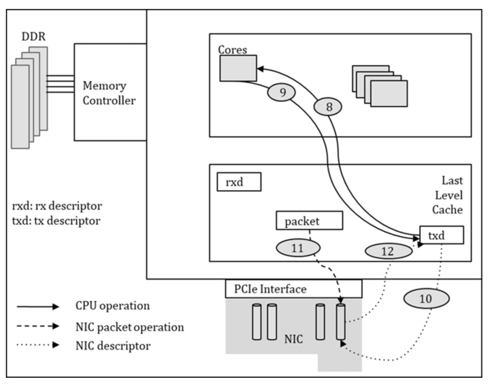
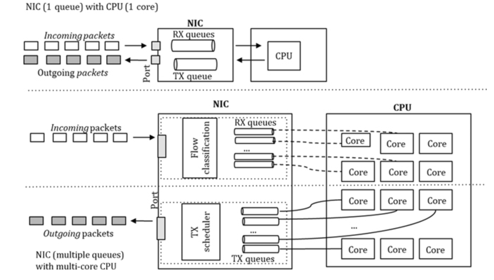
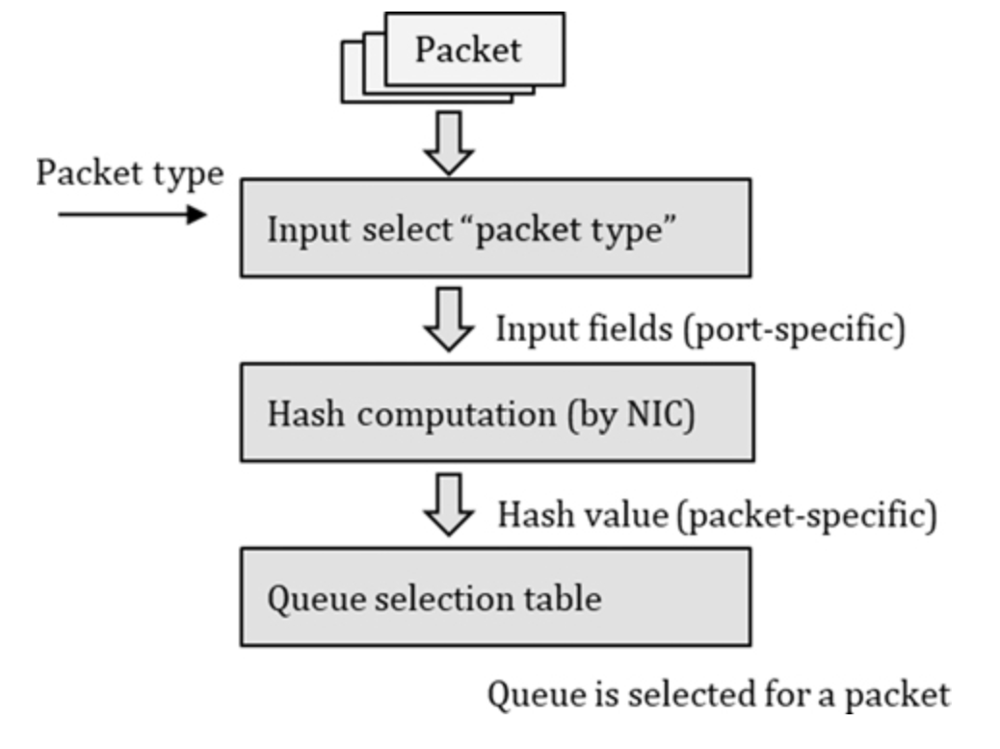
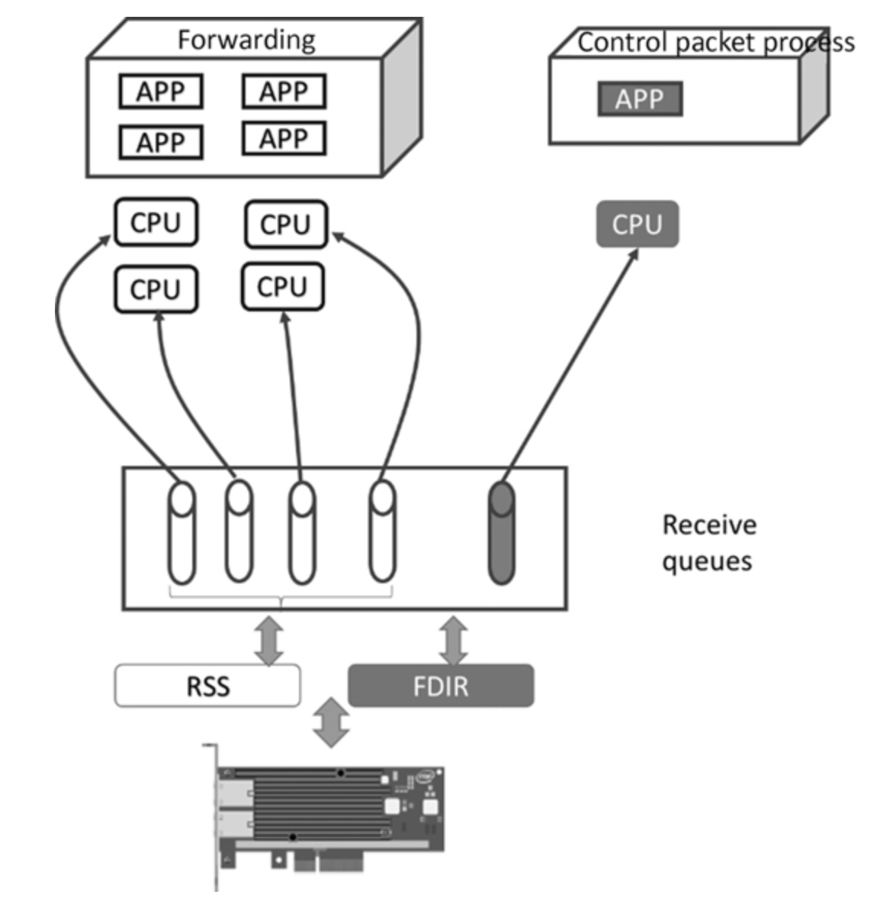
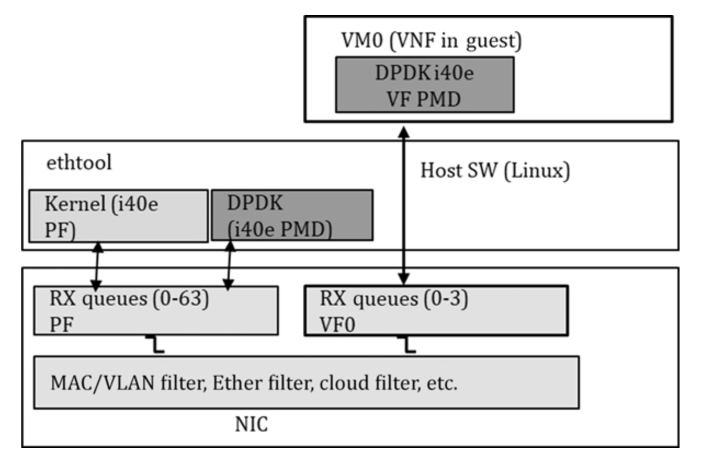

# 1 Introduction
## 1.1 What’s Packet Processing?

## 1.2 The Hardware Landscape
### 1.2.1 Hardware Accelerator
### 1.2.2 Network Processor Unit
### 1.2.3 Multicore Processor

## 1.3 The Software Landscape
### 1.3.1 Before DPDK

How does a traditional NIC device process the packet in a server system using Linux? The steps are summarized below:
* A packet arrives at a NIC (PCIe device).
* The NIC completes DMA (direct memory access) and copy packet into host memory region known as a packet buffer.
* The NIC sends an interrupt to wake up the processor.
* The processor reads and writes the packet descriptor and packet buffer.
* The packet is sent to the Linux kernel protocol stack for more protocol processing like IP-related access control decision.
* If the application resides in the user space, the packet data (also known as payload) will be copied from the kernel space to the user space.
* If the application resides in the kernel space, the data will be processed in the kernel mode (less percentage).

NAPI (new API) mechanism was introduced into the Linux kernel. It allowed the system, after wakeup by the interrupt, to initiate the software routine that processes multiple packets in a polling manner, until all packets are handled, then goes back to the interrupt mode. The NAPI method can significantly improve the packet processing efficiency in a high burst scenario.

As a time-sharing operating system, Linux will schedule many tasks with time-slicing mechanism. Compared with equal time assigned to all tasks, Linux scheduler has the job to assign the different time slices for different tasks.

Intel® engineers need answer for the following:
* A software path to enable the packet processing on x86 CPU;
* Find a better software method to do things differently;
* A performance scale way using multicore architecture;
* How to tune "Linux system" as packet processing environment.

### 1.3.2 DPDK Way

**Polling mode**: Assign the dedicated core for NIC packet reception and transmission. This approach does not share core for other software tasks, and the core can run in the endless loop to check if any packet just arrives or needs to be sent out, thus reducing the need for interrupt service and its overhead. We will discuss the trade-offs between polling and interrupt mechanisms later. In fact, DPDK supports both mechanisms and even hybrid-use model.

**User space driver**: In fact, in most scenarios, the packet needs to be sent to the user space eventually. Linux NIC driver is mostly kernel based. The user space driver can avoid unnecessary packet memory copy from the kernel space to the user space, and it also saves the cost of system calls. An indirect benefit is that the user space driver is not limited to the packet buffer structure mandated in the Linux kernel mode. Linux kernel stack mandates the stable interface, and the DPDK-based mbuf (memory buffer) header format can be flexibly defined (because it is new) so that it can be designed in DMA-optimized way for NIC. This flexibility adds the performance benefit. The user space driver is flexible, it is easy to modify, and it meets the rapid development needed for different scenarios.

**Core affinity**: By setting a thread’s affinity to a particular CPU core, specific tasks can be bound with cores (thread). Without the core affinity assignment, there might be the task switching among different cores, and the drawback to this assignment is that thread switching between cores can easily lead to performance losses due to cache misses and cache write-back. One further step is to ask a core to be excluded from Linux scheduling system, so that the core is only used for the specific task.

**Optimized memory**: Network processing is an I/O-bound workload scenario. Both CPU and NIC need access to the data in memory (actually cache and/or DRAM) frequently. The optimal memory access includes the use of HugePage and contiguous memory regions. For example, HugePage memory can reduce the TLB misses, multichannel-interleaved memory access can improve the total bandwidth efficiency, and the asymmetric memory access can reduce the access latency. The key idea is to get the data into cache as quickly as possible, so that CPU doesn’t stall.

**Software tuning**: Tuning itself cannot be claimed as the best practice. In fact, it refers to a few known tuning practices, such as `cache line alignment` of data structure, avoiding `false sharing` between multiple cores, `pre-fetching data` in a timely manner, and `bulk operations` of multiple data (multi-buffer). These optimization methods are used in every corner of DPDK. The code example can be found in the "l3fwd" case study. It is important to know that these techniques are commonly applicable; beyond DPDK, any software can be optimized with the similar approach.

Using the latest **instruction set and platform technologies**: The latest instruction sets of Intel® processor and other new features has been one of the innovation sources of DPDK optimization. For example, Intel® `DDIO` (Direct Data I/O) technology is a hardware platform innovation in DMA and the cache subsystem. DDIO plays a significant role to boost I/O performance as the packet data can be directly placed into cache, thus reducing the CPU access latency on DRAM. Without DDIO, packet is always placed into memory first, and then CPU needs to fetch packet data from DRAM into cache, which means the extra cycles that CPU needs to wait. The other example is how to make the best use of `SIMD (single-instruction multiple data)` and `multiple buffer` (multi-buffer) programming techniques. Some instructions, like `CMPXCHG`, are the cornerstone for lockless data structure design. `Crc32` instruction is also a good source for efficient hash computation. These contents will be covered in later chapters.

**NIC driver tuning**: When the packet enters the system memory through PCIe interface, I/O performance is affected by the transaction efficiency among the PCIe-based device, bus transaction, and the system memory. For example, the packet data coalescence can make a difference through transferring multiple packets together, thus allowing a more efficient use of PCIe bus transactions. Modern NICs also support load balancing mechanisms such as receive side scaling (`RSS`) and Flow Director (`FDir`) features, which enable NIC multiple queue to work with CPU multiple core model. New NIC offload can also perform the packet header checksum, TCP segmentation offload (TSO), and tunnel header processing. DPDK is designed to take full advantage of the NIC features for performance reasons.

**Network virtualization and cloud-native acceleration**: Initial DPDK optimization focuses on moving packets from I/O to CPU. Later, DPDK provides the optimal way to move packets from host to tenants (VM, container tenants). This is a crucial ingredient for cloud infrastructure and network function virtualization (NFV). DPDK supports both SR-IOV and vSwitch optimization with PMD concept.

**Security acceleration**: DPDK can run from the bare metal to the virtualized guest and container-based environment; the initial Application Programming Interface (API) abstraction is NIC centric; later, it is extended from Ethernet to crypto, compression, and storage I/O acceleration. Crypto and compression APIs are important software abstraction; they can hide the underlying silicon’s implementation difference.

### 1.3.3 DPDK Scope


## 1.4 Performance Limit
### 1.4.1 The Performance Metric
### 1.4.2 The Processing Budget

## 1.5 DPDK Use Case
### 1.5.1 Accelerated Network
### 1.5.2 Accelerated Computing
### 1.5.3 Accelerated Storage

## 1.6 Optimization Principles
## 1.7 DPDK Samples
### 1.7.1 HelloWorld
#### 1.7.1.1 Initialize the Runtime Environment
#### 1.7.1.2 Multicore Initialization
### 1.7.2 Skeleton
#### 1.7.2.1 Ethernet Port Initialization
### 1.7.3 L3fwd

## 1.8 Conclusion

# 2 Cache and Memory
## 2.1 Data Access and Latency

Intel® Xeon Processor Cache Access Latency


## 2.2 Intel Xeon Architecture

* RAM: random access memory;
* SRAM: static RAM;
* DRAM: dynamic RAM;
* SDRAM: synchronous dynamic random access memory;
* DDR: double data rate SDRAM;
* DDR2: the second generation of DDR;
* DDR3: the third generation of DDR;
* DDR4: the fourth generation of DDR. This is supported by Intel® Xeon SP;
* DDR5: the fifth generation of DDR. Product is expected in 2020.

## 2.3 Intel Atom SoC

## 2.4 Cache

A cache line is the minimum size of data block of load/write to the cache; this is defined by CPU and is not programmable by software.

### 2.4.1 Cache Line
### 2.4.2 Cache Prefetching

### 2.4.3 Software Prefetching

DPDK process a packet:
1. Write NIC RX descriptors into memory, and fill the descriptor with the data buffer pointer. Upon receiving a packet, the NIC will write the packet into the specified buffer.
2. Read the RX descriptors in the memory to check if a packet is received (the NIC will update the descriptors as soon as it receives the packet, memory read). After the packet arrival is confirmed, read the pointer of the control structure from the memory, and then read the control structure itself again from the memory (memory read). Fill the RX descriptors information to the control structure.
3. Update the NIC RX queue (RXQ) to indicate that a new packet is ready to be processed.
4. Read the packet header (memory read), and decide the next port for Packet TX.
5. Fill the packet information to the control structure in the NIC TX queue (TXQ) descriptors. Update the TXQ register.
5. Read the NIC TX descriptor from the memory (memory read), and check whether there are packets waiting to be transmitted by hardware.
6. If there are packets waiting, read the control structure from memory (memory read) and release the data buffer.

### 2.4.4 False Sharing

In computer science, [false sharing](https://en.wikipedia.org/wiki/False_sharing) is a performance-degrading usage pattern that can arise in systems with distributed, coherent caches at the size of the smallest resource block managed by the caching mechanism. When a system participant attempts to periodically access data that is not being altered by another party, but that data shares a cache block with data that is being altered, the caching protocol may force the first participant to reload the whole cache block despite a lack of logical necessity. The caching system is unaware of activity within this block and forces the first participant to bear the caching system overhead required by true shared access of a resource.

There is a cost for the data contention in a cache line, and if multicore is trying to access the different data in the same cache, CPU will invalidate the cache line and force an update, hurting the performance. This data sharing is not necessary because the multiple cores are not trying to access the same data, which is known as **false sharing**.

The compiler can find the false sharing, and it will try to eliminate the false sharing at the optimization phase.

If false sharing is identified, the software fix is simple: Just ensure the shared data elements reside in a different cache line. If a data structure is used for multicore use, each individual data member can occupy its own cache line.

```c++
#define RTE_CACHE_LINE_SIZE 64
#define __rte_cache_aligned __attribute__((__aligned__(RTE_CACHE_LINE_SIZE)))

struct rte_port_core_stats {
     __rte_cache_aligned uint64_t core1_pkts;
     __rte_cache_aligned uint64_t core2_pkts;
     __rte_cache_aligned uint64_t core3_pkts;
     __rte_cache_aligned uint64_t core4_pkts;
};
```

### 2.4.5 Cache Coherency

### 2.4.6 Noisy Tenant and RDT
Intel® proposed RDT (Resource Director Technology) framework to tackle the "noisy neighbor" problem, and RDT includes multiple technology ingredients such as cache monitoring, cache allocation, memory bandwidth monitoring, and cache and data optimization technologies. RDT is not specific to DPDK, so it is not introduced in this book.

## 2.5 TLB and HugePage

Linux supports the hugepage size as 2 MB or 1 GB. The memory translation is indeed a multilevel page table lookup.

In the latest Skylake processor, TLB entries are supported for 1 GB page size and 32 entries are supported for 2 MB page size.

There are two ways to reserve HugePage using Linux.
* Reserve the HugePage at Linux system initialization time and it will take this as the launch command option.
* Dynamic memory reservation after the Linux is launched.

### 2.5.1 Reserve HugePage at Boot time

> default_hugepagesz=1G hugepagesz=1G hugepages=4

### 2.5.2 Reserve HugePage at Runtime

Reserve 1024 pages of 2 MB memory (2 MB HugePages):

> echo 1024 > /sys/kernel/mm/hugepages/hugepages-2048kB/nr_hugepages

In the NUMA system with two nodes, we can use the following command:
> echo 1024 > /sys/devices/system/node/node0/hugepages/hugepages-2048kB/nr_hugepages
> echo 1024 > /sys/devices/system/node/node1/hugepages/hugepages-2048kB/nr_hugepages

Mount hugetlbfs like a path/mnt/huge.
> mkdir /mnt/huge
> mount -t hugetlbfs nodev /mnt/huge

## 2.6 Memory Latency


## 2.7 DDIO
Intel® DDIO enables the NIC and CPU to exchange data directly through the L3 cache, and NIC may move the packet into the LLC (instead of memory), as the new primary destination. In an optimized system, it reduces about 100 cycles for the arrived Ethernet packets.

## 2.8 NUMA

# 3 Core-Based Parallelism
## 3.1 Multicore Performance
### 3.1.1 Horizontal Scale
Amdahl’s law clearly indicates that the key to performance increase on a fixed workload needs to be focused on reducing the proportion of the sequential execution part in the whole task. For more information.

### 3.1.2 Multicore
The core in the CPU may stay idle while waiting for data arrival. HT is designed to reduce the CPU idle states. The CPU supports HT technology, and any physical core may contain logical cores N. When HT is enabled, the software sees two logical cores on one physical core. The technology is to reuse the multiple execution units of the superscalar pipeline more effectively.

Every logical core has its complete and independent register set, and includes local interrupt logic. There is no difference other than a physical thread from the software perspective.

Linux CPU Command Tools

CPU Information Command | Command
--- | ---
The number of cores (physical cores) | cat /proc/cpuinfo \| grep "cpu cores" \| uniq
The number of logical cores | cat /proc/cpuinfo    If "siblings" and "cpu cores" are consistent, it indicates that hyper-threading is not supported or disabled. If "siblings" is double to "cpu cores", it indicates that hyper-threading is supported and enabled.
Socket ID | cat /proc/cpuinfo \| grep "physical id" \| sort \|  uniq \| wc –l or lscpu \| grep "CPU socket"
Get ID for processor | cat /proc/cpuinfo \| grep "processor" \| wc –l

### 3.1.3 Affinity

1. Linux Kernel's support

    ```c++
    #include <sched.h>
    int sched_setaffinity(pid_t pid, size_t cpusetsize, cpu_set_t *mask);
    int sched_getaffinity(pid_t pid, size_t cpusetsize, cpu_set_t *mask);
    ```

2. Why Use Affinity?

    The most obvious benefit of binding the software task to the dedicated execution resource, which is indeed an optimal use of core resources if the performance is the key goal. Each core has its own dedicated L1/L2 cache. It keeps the most recently used data and instructions, and a dedicated running task implies the high chance of **cache hit** and is good for performance.

3. CPU Isolation

    Affinity binds the task to the assigned cores, but the Linux scheduler can load other tasks to the assigned cores.

    Add boot time parameter:
    > vim /boot/grub2.cfg
    > isolcpu=2,3

    Check boot time parameters:
    > cat /proc/cmdline
    > BOOT_IMAGE=/boot/vmlinuz-3.17.8–200.fc20.x86_64 root=UUID=3ae47813-79ea-4805-a732-21bedcbdb0b5 ro LANG=en_US.UTF-8 isolcpus=2,3

4. CPU Utilization, 100%?

    A core is often used with endless loop for packet processing, which also appears with 100% CPU utilization.

### 3.1.4 Core Pinning in DPDK

1. EAL lcore
    Linux scheduler does not manage the hardware cores that have been assigned to DPDK threads.

    

2. lcore Affinity

3. Support for User-Created Threads

4. Effecive Core Utilization

## 3.2 Instruction Concurrency and Data Parallelism
### 3.2.1 Instruction Concurrency

The modern multicore processor adopts the **superscalar** architecture to increase the instructions’ concurrency. It can complete multiple instructions within a clock cycle.




### 3.2.2 SIMD

Single-instruction multiple data (SIMD) improves performance by applying the instruction concurrency on the dimension of data width.

**Multiple data** define a specific width as a data unit, and multiple data units are operated independently.

**Single instruction** refers to the fact that for such a multiple data set, an instruction operation can be applied to all data units. SIMD is considered as a vectoring operation method.


SIMD uses the register sets with much wider than the general-purpose registers (GPRs) in order to hold the wide data units. It has evolved with 128-bit XMM registers, 256-bit YMM registers, and 512-bit ZMM registers, but the GPRs are still 64-bit width.

# 4. Synchronization

## 4.1 Atomic and Memory Barrier
### 4.1.1 Memory Barrier
Memory barrier, also known as memory fence, enforces the memory access (load/store) in order.

* LFENCE is a memory load fence; this ensures a serialization operation on all the previous memory loads that are globally visible.
* SFENCE is a memory store fence; it only enforces that all previous memory stores are globally visible.
* MFENCE is the combination to enforce that all the previous memory load and store operations are globally visible.

### 4.1.2 Atomic Operation

### 4.1.3 Linux Atomic Operation
#### 4.1.3.1 Atomic Integer Operation
#### 4.1.3.2 Atomic Bit Operation

### 4.1.4 DPDK Atomic Operation
#### 4.1.4.1 Memory Barrier API
#### 4.1.4.2 Atomic API

## 4.2 RWLock
### 4.2.1 Linux API
### 4.2.2 DPDK API

## 4.3 Spinlock

Spinlock is easy to cause the **self deadlock** if there is a repeated lock request from the same caller thread.

When using the spinlock, the recursive request may lead to the **recursive deadlock**. In the context of interrupt handling, the spinlock needs to be used more carefully. Generally, it is recommended to **disable interrupt** first, and this will avoid thread and interrupt competition.

### 4.3.1 Linux API
### 4.3.2 DPDK API

## 4.4 Lock-Free
### 4.4.1 RTE_RING
### 4.4.2 Enqueue/Dequeue
### 4.4.3 Producer/Consumer


# 5 Forwarding
## 5.1 Forwarding Models

A life cycle of packet goes through the system in the following order:
* Packet **input**: An incoming packet arrives at the hardware interface.
* **Preprocessing**: Parse the packet header in a coarse-grained manner.
* Input **classification**: Classify the packet in a fine-grained manner.
* **Ingress queuing**: Insert the packet into a FIFO (first in, first out) queue.
* Delivery/**scheduling**: Schedule based on queue priority and CPU status.
* **Accelerator**: Dedicated functions such as encryption/decryption and compression/decompression (e.g., IPsec).
* Parallel **CPU processing**: Complex processing via software, such as protocol and flow session management.
* **Egress queuing**: Schedule at packet exits according to QoS policy.
* **Post-processing**: Release the packet buffer in the post-processing.
* **Packet output**: Send the packet out through the hardware interface.


### 5.1.1 Pipeline Model

The pipeline model, as the name suggests, is inspired by the industrial pipelining assembly line model. It divides a complex function (above the modular level) into several individual stages, and each stage is connected via queues.

The networking system includes many compute- and I/O-intensive tasks; the pipeline model allows us to execute the compute-intensive tasks on a microprocessing engine and the I/O-intensive operations on another microprocessing engine. Each processing engine is task centric. Data are shared using queues between the tasks. Queues should have enough bandwidth to match the speed of the processing so that they will not become the bottleneck.

Data are shared using queues between the tasks. Queues should have enough bandwidth to match the speed of the processing so that they will not become the bottleneck. Also, the latency of the whole pipeline path is an important factor that should be considered carefully.

Limitations:
* The hardware-based pipeline can be limited on its programmability, the hardware resource is decided during the chip design phase.
* Hardware resource. For example, the on-chip memory can help the low-latency table lookup, but the on-chip memory size is often limited.


### 5.1.2 RTC Model

The run-to-completion (RTC or known as "run to end") model is relatively simple to understand. A program has the execution engine (e.g a CPU core) ownership; it will run until the task is completed.

The RTC model fits the charateristics of multicore system very well. RTC model doesn’t necessarily share data via queues among cores, as the entire task is completed on its own execution resource.

RTC is a sequential execution model; the whole path can be a series of complicated tasks, so it may include many memory accesses. Each memory access will cause additional access latency. For each memory access, core has to wait for the completion of data load/store. The latency may accumulate so that the overall latency will increase.

Software-based packet forwarding model has faster development cycle than hardware/software co-design model, and software provides high portability and low development cost. It aligns well with cloud-based elastic model. Which enables on-demand use of the hardware (core resources can be assigned dynamically for high or low network function needs).

### 5.1.3 Hybrid Model

The high-speed I/O (on NIC) can be handled by RTC model; more cores can work together with NIC RSS (receive side scaling) and the use of multi-queue. This relieves the I/O bottleneck on the server platform.

In addition to packet I/O, network function system comprises the packet **header parsing**, **protocol analysis**, and **packet modification**; the whole processing takes many table lookup, which is translated into many times of memory accesses. The accumulated memory latency in RTC model is not an effective way to make good use of CPU.

Solutions to mitigate the memory latency:
* One way is to combine the multiple memory access together by merging small table loopup into one big table looukup.
* From the system architecture perspective, the other way to improve efficiency is to leverage the pipeline model; the pipeline model is good at hiding memory access latency.
    * Break down the processing path into multiple tasks, then assign the different cores for the different tasks, and then connect all cores (tasks) to work together. The assigned core in the pipeline will only work on a specific task (as part of the pipeline stage), which improves the cache locality, thus resulting in higher efficiency.
    * The major benefit of using the pipeline model is **cache locality**. Each core only executes a small portion of the whole application; thus, it is more friendly to the instruction cache. It is also easier for hardware and software **prefetching** to read data ahead of time.


* RTC mode (a): Core 0 can be the control thread, which does not participate in the packet handling. Core 1 and Core 2 are the examples of RTC models; each core is responsible for the entire life cycle of packet processing, from Rx to Tx; Cores 3, 4, and 5 are using a similar RTC model; the difference is that NIC may turn on RSS features, so that the arrived packets may be processed by Cores 3, 4, and 5 for load balancing purpose.
* Pipe-line mode (b): The packet processing is divided into logical stages A, B, and C. A packet needs to go through Rx -> App A -> App B -> App C -> Tx stages. Rx/Tx is supported by Core 0. Depending on the workload complexity, both Core 1 and Core 2 are running the same tasks (App A -> App B ->App C); eventually, the packet is returned to Core 0 for packet Tx.

Perspective | Pipeline Model  | RTC Model
--- | --- | ---
Development | Easy, x86 core is general purpose, can do any task. Packet Framework is an existing implementation; the user can use it as a reference to build the features with software reuse (such as core/stages/tables, inter-core communication with queues, memory). Architecture focuses on the stage definition. | Easy. System consists of a list of function calls, often run as endless loop as a thread. Replicate to many cores.
Performance | Good way to hide the memory latency, I/O, and load balancing. Add the overhead between cores, workload-specific tuning on the pipeline stages. | Replicate to many cores. Increasing cache locality is a challenge. Reducing memory-related processing can be achieved with code refactoring and design optimization.

## 5.2 DPDK Specifics
### 5.2.1 RTC Model

DPDK initialization will reserve the specific cores to work on the NIC ports for packet Rx/Tx. If there are more NIC ports, a software developer can configure more cores. For the high-speed interface, the software developer can configure multiple queues for each interface, then assign multiple cores to do packet processing for those queues. This is a common approach of DPDK to realize performance scaling.

### 5.2.2 Pipeline Model




### 5.2.3 Packet Framework Port Library
The port library (librte_port) provides a standard interface to implement different types of packet ports. This library defines initialization and runtime operation of the packet ports.

\# | Port Type | Description
--- | --- |---
1 | SW Ring | A software circular buffer for packet/message transfer between pipeline modules.
2 | HW Ring | Queue of buffer descriptors used to interact with NIC, switch, or accelerator ports.
3 | IP Reassembly | Assembles IP fragments to an IP datagram.
4 | IP Fragmentation | Fragments input packets with IP datagrams larger than MTU (maximum transmission unit) size.
5 | Traffic Manager | Performs congestion management and hierarchical scheduling as per service-level agreements on an egress port.
6 | Source Port | Packet generator port, similar to Linux kernel/dev/zero character device.
7 | Sink Port | Packet terminator port to drop all input packets, similar to Linux kernel /dev/null character device.
8 | Kernel NIC Interface (KNI) Port | Interface for sending/receiving packets to/from Linux kernel space.

### 5.2.4 Packet Framework Table Library
\# | Table | Description
--- | --- | ---
1 | Hash Table | Exact match table; the lookup key is an n-tuple of packet fields that uniquely identifies a traffic flow. It is used to implement flow classification tables, ARP tables, etc.
2 | Longest Prefix Match (LPM) | The lookup key is an IPv4/IPv6 address. The lookup operation selects the longest IP prefix that matches the lookup IP address. Typically used to implement layer 3 routing tables.
3 | Access Control List (ACL) | The lookup key is n-tuples of packet fields. The lookup operation searches over a set of rules and finds the best match (highest priority). It is used to implement rule base for firewalls, etc.
4 | Array Tablet | The lookup key is a table entry index. It is used for implementing small databases such as IPv4 DSCP field entries, etc.

### 5.2.5 Packet Framework Pipeline Library

Once all the elements (input ports, tables, output ports) of the pipeline module are created, the input ports are connected to the tables, table action handlers are configured, and the tables are populated with the set of entries and associated actions


## 5.3 Forwarding Table and Algorithm
### 5.3.1 Hash Table

### 5.3.2 Hash Library
The first table is bucket-based signature table. It consists of an array of buckets, and each bucket has a fixed number of entries. Each entry contains a short signature of a key and an index to the key data pair. The second table consists of an array of key data pairs. When looking up a key, the signature in the first table will be compared first, and the key data pair in the second table is accessed only if the signature matches.

### 5.3.3 Elastic Flow Distributor
### 5.3.4 Longest Prefix Matching
### 5.3.5 ACL

## 5.4 Event Scheduling
Event/packet scheduling focuses on addressing how the packets are scheduled from I/O device to core, from core to core, and from core to device. The cost of event scheduling could be high if implemented in software. Hardware accelerator can help in some cases.

There are three packet-based event scheduling types:
* **Parallel**: Packets from the same flow can be distributed to multiple cores at the same time, without packet ordering requirement.
* **Ordered**: Packets from the same flow can be distributed to multiple cores but the packet order has to be restored at the egress port to the same order as ingress.
* **Atomic**: Only one packet from the same flow is processed at one time, system wide.

### 5.4.1 NIC-Based Packet Scheduler

RSS distributes the received packets into multi-queues for load balancing among multicores.

FDir directs the packet flow to the specific queue, which ensures the target core is the same one that handles the entire packet flow.

[Introduction to Intel® Ethernet Flow Director and Memcached :link:](https://www.intel.com/content/dam/www/public/us/en/documents/white-papers/intel-ethernet-flow-director.pdf)

### 5.4.2 Software-Based Packet Distributor

The software packet scheduling has two key problems:
* How to maintain the packet ordering in a parallel system.
* How to achieve it with high performance.


* The "Distributor Thread" communicates with the "Worker Threads" using a **cache line swapping** mechanism, passing up to 8 mbuf pointers at a time (one cache line) for each worker.

The key design for the "Distributor Thread" is the data structure which is exchanged among cores. Inter-core data path is a known bottleneck of scheduling. The data structure needs to be cache-friendly because the cores talk with each other through last level cache (LLC).



The least significant 4 bits can be used for other purposes, such as mbuf status flag in the following:
```c++
#define RTE_DISTRIB_NO_BUF 0 /**< empty flags: no buffer requested */
#define RTE_DISTRIB_GET_BUF (1) /**< worker requests a buffer, returns old */
#define RTE_DISTRIB_RETURN_BUF (2) /**< worker returns a buffer, no request */
```

Ideally, the "Distributor Thread" can send 8 mbuf pointers to the worker core every time, and the worker core returns 8 mbuf pointers after completing the batched packet processing. This cache-aligned communication between "Distributor" and "Worker" threads minimizes the cache coherence overhead.

Two other things to consider when developing a packet distributor based on these sample applications:
* Distributor needs a **dedicated core** for the packet scheduling work.
* The Worker Thread cannot handle the **asynchronous** task. The dispatching workflow is based on a blocking model, which cannot track the asynchronous packet.

### 5.4.3 Event Device

The eventdev library simplifies the packet processing with automatic multicore scaling, dynamic load balancing, pipelining, packet ingress order maintenance, and synchronization services.

* In a polling model, core polls NIC ports/queues to receive a packet.
* In an event-driven model, core polls the scheduler to select a packet.




An example life cycle of a packet:
* NIC receives the packet; RX core populates the flow id and then enqueues the packet to Queue 0.
* The scheduler checks the event flow id and queue id and then dispatches the packet event to Queue0::flow0 subqueue.
* Core 0 polls event from the Port 0 and then forwards this event to Queue 1, populates the queue id, and then enqueues event through Port 0.
* The scheduler checks the event flow id and queue id and then delivers event to Queue1::flow0 subqueue.
* Core 1 polls event from Port 1, updates the event type as TX, and then enqueues the event by Port 1.
* The scheduler checks the event type and then delivers the event to TX port.
* TX core dequeues the event and transmits the packet out.

Atom Scheduler Type
* 
* If there are four events that belong to flow0.
* Scheduler only dispatches one event of flow0 at one time. Before the dispatched event enqueues again, no other event that belongs to flow0 will be dispatched.
* If event0 is enqueued, then event1 will be dispatched.
* And so on.


Ordered Schedule Type:
* 
* There are four events that belong to flow 0.
* Scheduler dispatches e0, e1, e2, and e3 to different ports at the same time. For example, e3 is sent to por0, e0 is sent to port, e1 is sent to port2, and e2 is sent to port3.
* When e0, e1, e2, and e3 enqueue again, the scheduler will reorder all the events to keep them in order. For example, if the new enqueue order is e3, e1, e2, and e0, then the scheduler must reorder them as e0, e1, e2, and e3.

## 5.5 ip_pipeline

# 6 PCIe/NIC
## 6.1 PCIe
### 6.1.1 Protocol Stack

Peripheral Component Interconnect Express; it is a high-speed serial communication and interconnect standard interface.

The system bus is the bus interface to CPU, which is not open interface, which leaves the PCIe as the platform standard bus interface.


* Transaction Transport Layer
* Data Link Layer
* Physical Layer (logical and electrical submodules)


### 6.1.2 Transaction Overhead

The TLP header section defines a set of transactional packet types:
Type | Abbriviated Name
--- | ---
Memory read request | MRd
Memory read locked access | MRdLk
Memory write request | MWr
I/O read | IORd
I/O write | IOWr
Configuration read (Type 0 and Type 1) | CfgRd0 CfgRd1
Configuration write (Type 0 and Type 1) | CfgWd0 CfgWd1
Message request without data | Msg
Message request with data | MsgD
Completion without data | Cpl
Completion with data | CplD
Completion without data associated with locked memory read requests | CplLk
Completion with data associated with locked memory read requests | CplDLk

The Ethernet packets that the NIC receives the wire are transferred as the payload of the PCIe transport layer. The NIC implements its own DMA (direct memory access) controller to access the memory via the PCIe bus. When the CPU receives/sends a packet from/to the NIC, the following PCIe transaction types are used: Memory Read/Write (MRd/MWr) and Completion with Data (CpID).

For a normal TLP on 64-bit server platform, there are a total of **24 additional bytes** for transaction overhead. If the incoming Ethernet packet size is small (e.g., 64 bytes), the overhead is indeed significant.

### 6.1.3 Interface Metrics

## 6.2 TLP Example
## 6.3 NIC Descriptor

The NIC interacts with the CPU (and its software) via a ring-based queue, which consists of many packet buffer descriptors, with the ring being a circular buffer in system memory.

The NIC driver is responsible for the following basic steps:
* Fill the packet memory address into the descriptor so that the NIC can use it to DMA the packet arrives on wire.
* Move the Tail register; NIC will read and know how many descriptors are available.
* Check the "DD" bit of the descriptor. For packet RX is done, refilling the packet memory buffer is required. For packet TX is done, releasing the memory buffer is done.
* Configure the buffer descriptor (rte_mbuf).
* Process the buffer descriptor.
* Handle the scatter-gather, RSS (receive side scaling) and NIC offload, etc.


The platform memory bandwidth is usually significantly higher than any individual PCIe interface bandwidth. For packet processing workloads, memory bandwidth is not a big challenge; it is mainly the PCIe interface that is the bottleneck.

## 6.4 RX/TX Procedure


### 6.4.1 High-Level View

#### 6.4.1.1 RX


1. The CPU fills the packet buffer address into the RX descriptor.
2. The NIC reads the RX descriptor (rxd) to obtain the memory address.
3. The NIC writes the packet to the specified memory address (DMA).
4. The NIC updates the RX descriptor to notify the RX completion.
5. The CPU reads the RX descriptor and completes the packet RX
6. The CPU processes the packet and decides the next step (processing).
7. The CPU may change the packet and send it.

#### 6.4.1.2 TX



8. The CPU reads the TX descriptor to check if any packet is sent successfully.
9. The CPU writes the packet buffer address to the next TX descriptor.
10. The NIC reads the TX descriptor to get the packet memory.
11. The NIC reads the packet data from the address.
12. The NIC updates the TX descriptor after packet TX is completed.


The physical bandwidth of PCIe interface is indeed high. Take PCIe Gen2 x8 as an example: The throughput is up to 4 GB/s (32 Gbps). In reality, the effective data throughput is much less. Why? Because the packet moves between the main memory and the NIC device through DMA and PCIe bus transactions, and the PCIe bus is consumed by in/out packet data movement and NIC register access (MMIO). Also, the reads/writes {2,4,10,12} of the RX/TX descriptors described above need to be taken into consideration.

### 6.4.2 Optimization Ideas
1. Reduce the MMIO access:

    NIC configuration and control are done by accessing the device registers; they use MMIO access.

    When a packet is received, the Tail register is updated after a new packet buffer is allocated and refilled to the RX descriptor. If the packet buffer allocation and descriptor refills are batched together, we can reduce the total time spent updating the Tail.

2. Improve the PCIe data transfer efficiency:

    Packet descriptors can be accessed by both the CPU and the NIC. Every read or write of the descriptor is a PCIe transaction. Assuming each descriptor is 16 bytes long, then the payload will be smaller than PCIe/TLP overhead (24 bytes), resulting in a lower utilization on PCIe/TLP data transfer bandwidth.

    If we combine multiple descriptor accesses, we can merge four descriptor accesses into one PCIe transaction, which will result in a total payload of 16 bytes × 4 = 64 bytes, which happens to be the same as the cache line size. So, this larger TLP payload can make much more effective use of PCIe bandwidth.

3. Avoid partial writes of the cache line whenever possible

    When a DMA engine is writing the packet data to the memory buffer, partial writes can happen in the following conditions:
    * The buffer address is not cache line-aligned.
    * The written length is not a multiple of the cache line size.

    Partial writes of the cache line will lead to a merge of memory read–modify–write operations and cause additional reads, thus reducing the overall performance.

## 6.5 Throughput Analysis
## 6.6 Packet Memory
### 6.6.1 Mbuf


The software driver uses mbuf header to interact with NIC hardware for every packet in and out.

All mbufs are cache line-aligned, but their size is configurable. Given that most Ethernet frame sizes are less than 1500 bytes, it is common to see the default mbuf packet size is set as 2KB.

All mbufs are cache line-aligned, but their size is configurable. Given that most Ethernet frame sizes are less than 1500 bytes, it is common to see the default mbuf packet size is set as 2KB.

Packet descriptor (metadata) contains the packet header information such as VLAN label, RSS hash values, and arrived port number.


### 6.6.2 Mempool

# 7 PMD
## 7.1 DPDK Poll Mode
### 7.1.1 Interrupt Mode

The interrupt service has the cost of context switch, and the overhead exists for every interrupt service.

### 7.1.2 Poll Mode

Through the math model and analysis, it makes sense to assign the dedicated cores to handle the high-speed NIC in order to sustain the packet processing at the line rate.

PMD is responsible for NIC port/queue initialization and setup, which includes filling the mbuf elements to HW (Hardware) descriptor and informing NIC to place the incoming packet to the specified memory address; packet metadata is updated into the buffer descriptor. PMD is responsible for allocating more buffers to accommodate the large size packet.

### 7.1.3 Hybrid Mode


1. The DPDK application creates a polling thread, which runs in the busy poll mode to check if any packets need to be received. By default, the interrupt is turned off.
2. The polling thread detects the incoming packets on a core basis. If no packet is received, a conservative approach is implemented to decide the core idle time and then what’s next step. Two actions are given in case of no packets are received in the example.
    * Within the core idle threshold (configurable by MACRO: SUSPEND_THRESHOLD), use "Pause" instruction to delay the busy poll for a specified time, which is implemented by "rte_delay_us" API.
    * If the idle exceeds the configured threshold, interrupt/epoll mode is supported/enabled at the port/queue level (rte_eth_dev_rx_intr_ctl_q), the example strategy will turn on the port/queue interrupt, and the core enables one-time interrupt service before sleep.
3. The core (polling thread) will block on epoll event: "rte_epoll_wait" is used here, which depends on epoll_wait.
4. If a packet comes on the wire, the NIC will trigger a "Rx Interrupt".
5. Depending on the kernel module, it will notify the igb_uio module if "UIO" is in place.
6. UIO (user space I/O) will notify the user space with "uio_event_ notify".
7. The sleep core is waked up, and it will return on "rte_poll_wait".
8. The polling thread is back to work, and it will disable the port/queue interrupt and continue the busy poll mode.

The HIP mode depends on the interrupt notification from the kernel modules, which can be UIO or VFIO (virtual function I/O). For VFIO-based implementation, the interrupt is supported at the queue level; every rxq can have its own interrupt number, because VFIO supports multiple MSI-X interrupt numbers. For UIO-based implementation, only one interrupt number is shared by all the RX queues.

## 7.2 Performance Optimization

For each packet RX, the packet memory is loaded into cache, the adjacent data is also loaded to the cache, and the memory access always happened with a cache line size (like 64 bytes). The prior data in the cache can be vacated while doing the packet computation; then the next use of the adjacent data becomes a problem; it may have to load the data from a lower-level cache or access the memory again.

### 7.2.1 Burst Processing

**Burst** decomposes the packet RX/TX into multiple small processing stages, allowing the adjacent data access and similar processing together. Thus, this can minimize the memory access for the multiple data read/writes, and the cache utilization can be highly effective. Packet burst processing is about to handle multiple packets (such as 8, 16, or even 32) at a time. The number of packets is determined by the DPDK user.

DPDK uses the burst processing, and it is a well-known optimization idea. It decomposes the packet RX/TX into multiple small processing stages, allowing the **adjacent data access** and **similar processing** together. Thus, this can minimize the memory access for the multiple data read/writes, and the cache utilization can be highly effective. Packet burst processing is about to handle multiple packets (such as 8, 16, or even 32) at a time. The number of packets is determined by the DPDK user.

The **prefetch** mechanism (hardware or software based) can help the adjacent cache lines to be accessed at one time. If four cache lines are updated, 16 descriptor (each size is 16 bytes long) accesses can be combined.

In the non-burst design, only one packet was received at one time, and then it is processed and sent, at an individual basis. For each packet RX, the packet memory is loaded into cache, the adjacent data is also loaded to the cache, and the memory access always happened with a cache line size (like 64 bytes). The prior data in the cache can be vacated while doing the packet computation; then the next use of the adjacent data becomes a problem; it may have to load the data from a lower-level cache or access the memory again.

In the packet burst design, multiple packets can be processed at a time. When the data is loaded in the first time (for the first packet), the adjacent data may be useful to the next packet’s use. This means only one memory access (or lower-level cache access) is required to receive two or more packets. This way, fewer memory access (or low-level cache access) is required to complete the multiple packets of RX.

### 7.2.2 Batch Processing

* **Latency**: The number of clock cycles to run an instruction.
* **Throughput**: The number of clock cycles to run the same instruction again.

Latency describes the waiting interval between two instructions, whereas throughput describes the concurrency capacity. The instruction latency is relatively fixed, concurrency can enhance the overall system performance, and issuing more instructions will help to increase concurrency.

Modern CPU architecture is optimized with out-of-order execution and high concurrency. The effective method on instruction latency hiding is the batch processing; it is valid if there is no data dependency. The repetitive task can be done with a successive loop.


Packet RX needs the multiple memory access (such as descriptor and buffer read/write)

In theory, the CPU and NIC (DMA engine) may try to access the same data. There are two kinds of data access:
* Read–write conflict: Use the DD flag as an example. If packet RX is completed at NIC side, NIC will write the flag. Meanwhile, the CPU is polling this flag periodically.
* Write–write conflict: CPU needs to assign the new packet buffer and refills them to NIC RX descriptor ring. Meanwhile, NIC will write the ring as part of packet RX, which is a DMA write-back.


In DPDK, ixgbe PMD has the batch processing for the packet RX/TX:
1. The PMD checks if 8 packets are ready on the NIC’s receive queue. If so, the software will parse the hardware descriptor and translate the NIC descriptor to software-based packet metadata fields (mbuf). This is repeated until 32 packets are received, or no further packets arrived.
2. Then, PMD will check if there is a need to allocate more packet buffers. If the threshold is reached, PMD will ask for many mbufs at a time.
3. The final step will look into the actual number of packets in a burst, and refill the packet buffers as needed.

### 7.2.3 SIMD

The Intel® SSE (Streaming SIMD Extensions) instruction is based on 128-bit register, whereas AVX (advanced vector extensions) provides a 256-bit register and AVX512 provides a 512-bit register.

## 7.3 Platform Configuration
### 7.3.1 Hardware Impacts


DPDK is designed to be local or remote socket aware, and many software APIs are asking "socket" as the explicit input parameter.

Using the remote core to handle the PCIe card will lead to extra inter-CPU communication, thereby slowing down the performance. PCIe slot is always attached to one CPU, and this is finalized in the motherboard design.

command "lspci–vvv" can inspect the PCIe interface and details.

I/O interfaces do not guarantee the NIC’s maximum networking performance. Don’t assume that 2x40Gbe Ethernet ports will deliver 80 Gbps I/O simultaneously. Other system factors such as the Ethernet chip capability and PCIe slot (speed and lanes) affect the I/O performance.

Most NICs generally support multi-queues for packet I/O. When receive-side scaling (RSS) is enabled, NIC can distribute the packets into multiple queues, and then multiple cores can handle one or more queues for load balancing.


### 7.3.2 Software Impacts

* Huge page

    > default_hugepagesz = 1G hugepagesz = 1G hugepages = 8

    > cat /proc/meminfo

* CPU isolation

    > isolcpus = 2,3,4,5,6,7,8

* PCIe extended tag

    > CONFIG_RTE_PCI_CONFIG=y
    > CONFIG_RTE_PCI_EXTENDED_TAG="on"

    In the dual-socket system, the principle is to use the local core to drive the local Ethernet port.


## 7.4 NIC Tuning
### 7.4.1 RXQ/TXQ Length
### 7.4.2 RXQ/TXQ Threshold

# 8 NIC-Based Parallellism



## 8.1 Multi-Queue
### 8.1.1 NIC Support

As the name suggests, the NIC RX/TX path has multiple hardware queues, and each queue can be associated with a specific core. In order to use the multiple queues, NIC came up with a few mechanisms (which will be discussed later) to distribute the incoming packets to the queues, and the actual packet move to the host memory is done with NIC DMA (direct memory access). When the CPU handles the packet, the packet and its buffer descriptor need to be loaded into cache. This memory and cache procedure is further optimized by the Intel® DDIO technology.

The number of queues can be different at the RX/TX sides. The system designer will decide the following:
* How many queues need be configured?
* How many cores can be used for NIC driver (RX/TX)?
* How many cores are available for other packet processing software use?
* What are the packet distribution methods to send packets from the I/O core to different worker cores (for load balance processing, or application steer processing)?


The steps involved in the packet-receiving process are summarized below:
1. Recognizing a packet arrived on the Ethernet port
2. Filtering the packet on L2 Ethernet protocols
3. Queue assignment (such as Pool Select and Queue Select)
4. Moving the packet into the receive data FIFO
5. Transferring the packet into the host memory, owned by the specified queue
6. Updating the status of the packet buffer descriptor

### 8.1.2 Linux Support

For a NIC with a single queue, the software has to support the traffic load balance to multiple cores. The Linux kernel handles this with the Receive Packet Steering (**RPS**) mechanism. RPS is mainly responsible for distributing software interrupts across CPU cores.

#### 8.1.2.1 NIC RX

The NIC driver sets an interrupt request (IRQ) identifier for each RX queue. When a packet arrives, an IRQ is delivered to a core, which will serve the interrupt with software routine.

IRQ affinity (smp_affinity) is such a mechanism, each IRQ can be allocated its affinity and assigned to a set of cores (using bit mask), and these affinitized cores can take care of the interrupts.

#### 8.1.2.2 NIC TX

The **XPS** (Transmit Packet Steering, introduced after Linux kernel 2.6.38) mechanism can intelligently select one of the multiple queues to send the packet. A mapping from the core to a TX queue is available.”
* lock contention will be reduced because it reduces the competition for the same queue. The lock contention will be totally eliminated if each core has its own TX queue
* the chance of cache miss is decreased during packet transmission.

### 8.1.3 DPDK Support

DPDK principles are listed as follows:
* Each NIC port will be configured with multi-queue at both the RX and TX sides, owned by DPDK PMD.
* DPDK supports the port, queue, and core binding mechanism.
* If a RX queue of the NIC is assigned to a core, the packets received from the queue are assumed to be processed completely on that core. This is the run-to-completion model.
* If the memory pool is allocated from the local memory channel, closer to the core, both the received packet and the buffer descriptor should be located in the same memory pool.
* If a TX queue is assigned to the core, both the packet and its buffer descriptor should be located in the local memory pool corresponding to the core and the TX queue.

## 8.2 Flow Classification

Flow classification is how a NIC receives, parses, and classifies the arrived packet header with an action. The classification result can be written into the received packet descriptor. Because this is done by the NIC, it saves CPU cycles to do a similar job with software.


Technique | Matching Information | Action
--- | --- | ---
Packet type | Protocol info | Mark packet type
SR-IOV/VMDQ | MAC address, VLAN ID | Mark to queue set
RSS | IP address, port ID  | Director to queue
Flow Director | IP address, port ID | Director to queue/drop
QoS | UP in VLAN tag (3-bits) | Mark to queue set
Legitimacy verification | MAC address, VLAN ID | Mark to queue set/director

### 8.2.1 Packet Type

NIC can read the incoming packet header to recognize “many” packet types and write the packet type into the buffer descriptor.

### 8.2.2 Receive-Side Scaling (RSS)


1. First, the packet type should be selected; then, depending on the different packet types, the different packet input fields can be used for hash computation.
2. Hash computation is customizable, though the algorithm is implemented on NIC.
3. Hash value determines the queue index, which directs the packet into a specific queue. It is determined by a table that maps from the hash value calculated from the packet’s fields to the queues in the hardware.

### 8.2.3 Flow Director (FDIR)


The NIC parses the incoming packet header to get the packet type and will look up the Flow Director table; if “input fields” match a flow table entry, the defined action will be taken.

### 8.2.4 NIC Switching
Switching capability is a feature for the cloud-based use case. As shown in the below figure, a system is running with the host and many virtual machines. The NIC has to be partitioned so that some VFs are assigned by the VMs.


If the NIC is embedded with an internal switch, sometimes it is called **SR-IOV-based switching**, and the packet forward decision can be made on a NIC; it compares the Ethernet header such as MAC/VLAN fields to do an internal switching.


### 8.2.5 Customized Flow Classification
## 8.3 Use Case
### 8.3.1 Hybrid RSS and FDIR


* Enable RSS & RD
    ```c++
    static struct rte_eth_conf port_conf = {
        .rxmode = {
            .mq_mode = ETH_MQ_RX_RSS,
        },
        .rx_adv_conf = {
            .rss_conf = {
                .rss_key = NULL,
                .rss_hf = ETH_RSS_IP | ETH_RSS_UDP | ETH_RSS_TCP | ETH_RSS_SCTP,
            },
        }, //Enable RSS
        .fdir_conf = {
            .mode = RTE_FDIR_MODE_PERFECT,
            .pballoc = RTE_FDIR_PBALLOC_64K,
            .status = RTE_FDIR_REPORT_STATUS,
            .mask = {
                .VLAN_tci_mask = 0x0,
                .ipv4_mask = {
                    .src_ip = 0xFFFFFFFF,
                    .dst_ip = 0xFFFFFFFF,
                },
                .ipv6_mask = {
                    .src_ip = {0xFFFFFFFF, 0xFFFFFFFF, 0xFFFFFFFF, 0xFFFFFFFF},
                    .dst_ip = {0xFFFFFFFF, 0xFFFFFFFF, 0xFFFFFFFF, 0xFFFFFFFF},
                },
                .src_port_mask = 0xFFFF,
                .dst_port_mask = 0xFFFF,
                .mac_addr_byte_mask = 0xFF,
                .tunnel_type_mask = 1,
                .tunnel_id_mask = 0xFFFFFFFF,
            },
            .drop_queue = 127,
        },//Enable the Flow Director.
    };
    ```

* Config TX and RX Queue
    ```c++
    mbuf_pool = rte_pktmbuf_pool_create();

    for (q = 0; q < rxRings; q ++) {
        retval = rte_eth_rx_queue_setup(
            port, q, rxRingSize,
            rte_eth_dev_socket_id(port),
            NULL,
            mbuf_pool
        );
        if (retval < 0)
            return retval;
    }

    for (q = 0; q < txRings; q ++) {
        retval = rte_eth_tx_queue_setup(
            port, q, txRingSize,
            rte_eth_dev_socket_id(port),
            NULL
        );
        if (retval < 0)
            return retval;
    }
    //Configure the send and receive queues.
    //In this case, rxRings = 5; txRings = 5.
    ```

* Set up Flow Director
    ```c++
    struct rte_eth_fdir_filter arg = {
        .soft_id = 1,
        .input = {
            .flow_type = RTE_ETH_FLOW_NONFRAG_IPV4_UDP,
            .flow = {
                .udp4_flow = {
                    .ip = {.src_ip = 0x03020202, .dst_ip = 0x05020202,}
                    .src_port = rte_cpu_to_be_16(1024),
                    .dst_port = rte_cpu_to_be_16(1024),
                }
                // Prepare the Flow Director config
            }
        }
        .action = {
            .rx_queue = 4,
            .behavior= RTE_ETH_FDIR_ACCEPT,
            .report_status = RTE_ETH_FDIR_REPORT_ID,
        }
    }

    rte_eth_dev_filter_ctrl(port, RTE_ETH_FILTER_FDIR, RTE_ETH_FILTER_ADD, &arg);
    // Add the Flow Director entry to the table.
    ```

    Reconfig RSS to remove queue3 from RSS table
    ```c++
    // Configure the hash value queue number mapping table.
    // The table size is 128 for 82599 NIC.
    struct rte_eth_rss_reta_entry64 reta_conf[2];
    int i, j = 0;
    for (idx = 0; idx < 3; idx++) {
        reta_conf[idx].mask = ~0ULL;
        for (i = 0; i < RTE_RETA_GROUP_SIZE; i++, j++) {
                if (j == 4)
                    j = 0;
                reta_conf[idx].reta[i] = j;
        }
    }
    rte_eth_dev_rss_reta_query(port, reta_conf, 128);
    ```

### 8.3.2 Virtualization



### 8.3.3 Rte_flow

# 9 NIC Offload
## 9.1 NIC Offload
## 9.2 Offload Flags
## 9.3 Offload Capability
## 9.4 Header Parsing
### 9.4.1 VLAN Offload
### 9.4.2 IEEE1588 Offload
### 9.4.3 Checksum Offload
### 9.4.4 Tunnel Offload
### 9.4.5 Segmentation Offload (TSO)